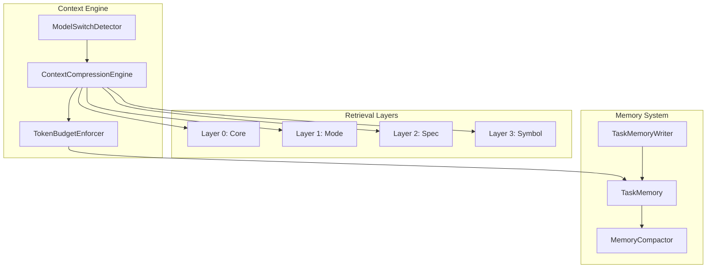

# Design Document: Adaptive Context Management

## Overview

The Adaptive Context Management system implements a layered, signal-aware context retrieval and persistence model. It replaces static context injection with a dynamic engine that balances token usage against task state.

## Architecture

### Component Diagram



### Integration Points

1.  **System Prompt Generation (`system.ts`)**: Wraps existing section functions with `ContextCompressionEngine` to assemble layers L0-L3.
2.  **Environment Details (`getEnvironmentDetails.ts`)**: Splits environment injection into Tier A (Critical) and Tier B (Detailed).
3.  **Task Execution Loop (`Task.ts`)**: `TaskMemoryWriter` listens to tool signals; `ModelSwitchDetector` monitors model changes.
4.  **Condensation Pipeline (`condense/index.ts`)**: `summarizeConversation()` is augmented with `TaskMemory` and evidence blocks.

## Data Structures

### TaskMemory
```typescript
interface TaskMemory {
    objective: string
    findings: string[]
    hypotheses: string[]
    edits: string[]
    tests: string[]
    blockers: string[]
    status: "active" | "diagnosis_confirmed" | "resolved" | "abandoned"
}
```

### ModelUsageRecord
```typescript
interface ModelUsageRecord {
	provider: string
	modelId: string
	turnIndex: number
}
```

## Algorithms

### 1. Layer Reduction
Reduces context in order: L3 (Symbol) -> L2 (Spec) -> L1 Extended -> Tier B (Env) -> L1 Base.

### 2. Signal-Based Memory Update
Tool results trigger updates:
- File write -> `edits[]`
- Test result -> `tests[]`
- Error -> `blockers[]`

### 3. Model Switch Detection
Compares `{provider, modelId}` of current request against a lookback window (default 1). If different, forces condensation.

## Performance Constraints
- **L0-L3 Assembly**: < 100ms overhead.
- **Memory Operations**: Synchronous, in-memory.
- **Token Cap**: Enforced at turn start; target 2k-6k tokens.
