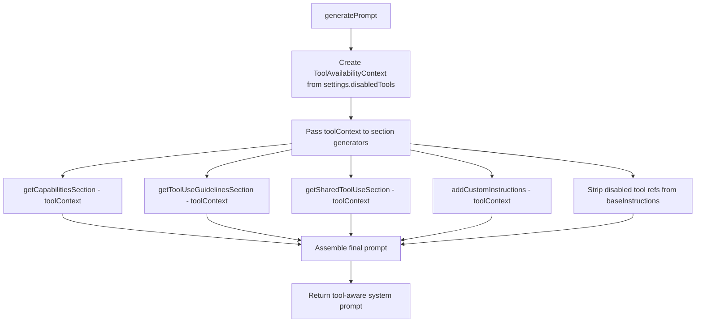
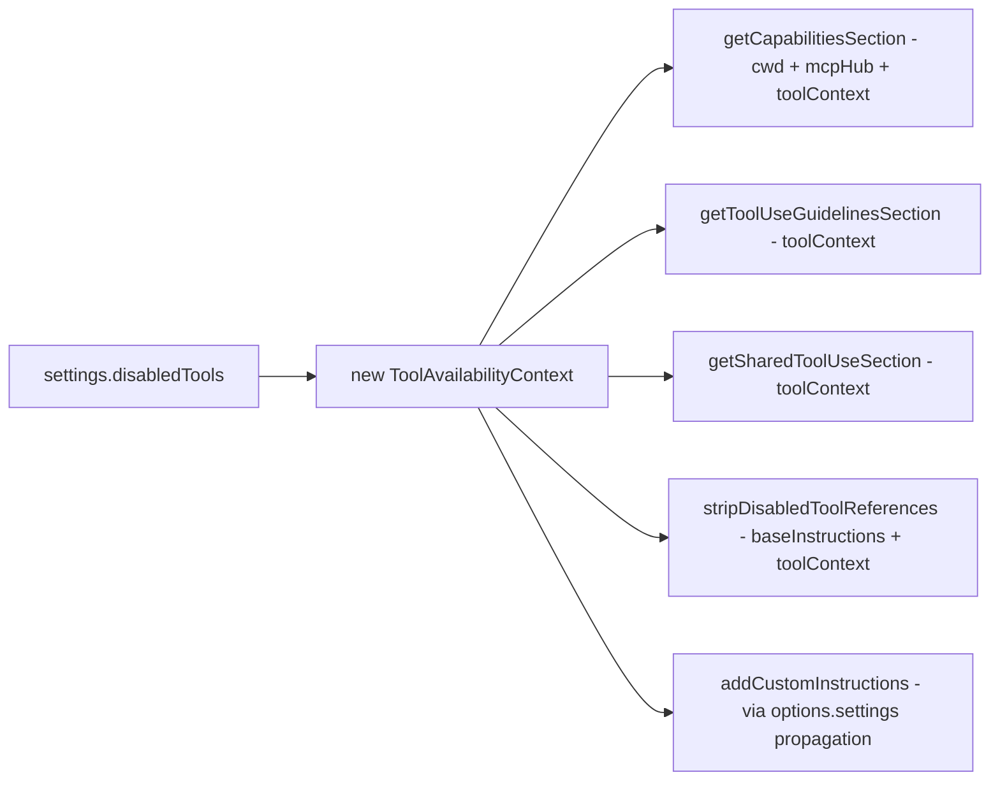

# Design: Dynamic System Prompt Tool Instruction Removal

## Architecture Overview

The core design introduces a **`ToolAvailabilityContext`** — a lightweight abstraction that encapsulates which tools are available in the current session. This context is created once during prompt generation and passed to all section generators that need tool-awareness, enabling each section to dynamically compose its output based on actually-available tools.



## Component Design

### 1. ToolAvailabilityContext

A new class in [`src/core/prompts/tools/tool-availability-context.ts`](src/core/prompts/tools/tool-availability-context.ts) that provides a clean query interface for tool availability.

```typescript
export class ToolAvailabilityContext {
  private readonly disabledTools: Set<string>

  constructor(disabledTools: string[]) {
    // Resolve aliases so disabling a legacy alias also marks the canonical tool
    this.disabledTools = new Set(
      disabledTools.map(name => resolveToolAlias(name))
    )
  }

  isToolAvailable(toolName: string): boolean {
    return !this.disabledTools.has(resolveToolAlias(toolName))
  }

  isToolDisabled(toolName: string): boolean {
    return this.disabledTools.has(resolveToolAlias(toolName))
  }

  hasAnyAvailable(): boolean {
    return this.disabledTools.size < ALL_NATIVE_TOOL_NAMES.length
  }

  areAllDisabled(): boolean {
    return this.disabledTools.size >= ALL_NATIVE_TOOL_NAMES.length
  }
}
```

**Key decisions**:
- Alias resolution happens at construction time, so all subsequent queries are O(1) Set lookups
- The class is immutable after construction — safe to pass around
- `ALL_NATIVE_TOOL_NAMES` is derived from the existing tool definitions catalog

### 2. Capabilities Section — Dynamic Composition

**File**: [`src/core/prompts/sections/capabilities.ts`](src/core/prompts/sections/capabilities.ts)

**Current**: A single static template string with hardcoded tool references.

**New**: The function signature changes to accept `toolContext`:

```typescript
export function getCapabilitiesSection(
  cwd: string,
  mcpHub?: McpHub,
  toolContext?: ToolAvailabilityContext
): string
```

**Dynamic content strategy**:

| Content Block | Condition | Fallback |
|--------------|-----------|----------|
| Opening summary line | Dynamically lists only available tool categories | If all tools in a category are disabled, that category phrase is omitted |
| `list_files` paragraph | `toolContext.isToolAvailable('list_files')` | Remove the `list_files`-specific sentence; keep the generic workspace directory info |
| `execute_command` paragraph | `toolContext.isToolAvailable('execute_command')` | Remove entire paragraph |
| MCP paragraph | Already conditional on `mcpHub` | No change needed |

**Capability category mapping** — used to dynamically compose the opening line:

```typescript
const CAPABILITY_PHASES: Record<string, { tools: string[]; phrase: string }> = {
  cli:       { tools: ['execute_command'], phrase: 'execute CLI commands on the user\'s computer' },
  files:     { tools: ['list_files'], phrase: 'list files' },
  search:    { tools: ['search_files', 'codebase_search'], phrase: 'regex search' },
  code:      { tools: ['read_file'], phrase: 'view source code definitions' },
  edit:      { tools: ['write_to_file', 'apply_diff', 'edit_file', 'search_replace', 'apply_patch'], phrase: 'read and write files' },
  questions: { tools: ['ask_followup_question'], phrase: 'ask follow-up questions' },
}
```

The opening line is composed by joining the phrases of categories where at least one tool is available:
> "You have access to tools that let you {dynamic phrase list}."

If `toolContext` is undefined or `areAllDisabled()` is true, a minimal fallback is used:
> "You have access to a set of tools for interacting with the user's environment."

### 3. Tool Use Guidelines — Dynamic Example

**File**: [`src/core/prompts/sections/tool-use-guidelines.ts`](src/core/prompts/sections/tool-use-guidelines.ts)

**Current**: Hardcoded example referencing `list_files`.

**New**: Accept `toolContext` and pick an available tool for the example:

```typescript
export function getToolUseGuidelinesSection(
  toolContext?: ToolAvailabilityContext
): string
```

**Example tool priority list** — pick the first available:

```typescript
const EXAMPLE_TOOL_PRIORITY = [
  { name: 'list_files',    example: 'using the list_files tool is more effective than running a command like `ls` in the terminal' },
  { name: 'read_file',     example: 'using the read_file tool is more effective than running a command like `cat` in the terminal' },
  { name: 'search_files',  example: 'using the search_files tool is more effective than running a command like `grep` in the terminal' },
  { name: 'execute_command', example: 'using the execute_command tool lets you run complex operations directly' },
]
```

If no example tool is available, the example sentence is omitted entirely and the guideline becomes a shorter 2-point list.

### 4. Shared Tool Use Section — All-Tools-Disabled Guard

**File**: [`src/core/prompts/sections/tool-use.ts`](src/core/prompts/sections/tool-use.ts)

**Current**: Always included, generic content.

**New**: Accept `toolContext` for the all-disabled edge case:

```typescript
export function getSharedToolUseSection(
  toolContext?: ToolAvailabilityContext
): string
```

- If `toolContext` is undefined or tools are available → return current content unchanged
- If `toolContext.areAllDisabled()` → return minimal: `"====\n\nTOOL USE\n\nNo tools are available in the current session. Respond directly to the user without attempting tool calls."`

### 5. Response Messages — Tool-Aware Next Steps

**File**: [`src/core/prompts/responses.ts`](src/core/prompts/responses.ts)

**Current**: [`noToolsUsed()`](src/core/prompts/responses.ts:42) and [`missingToolParameterError()`](src/core/prompts/responses.ts:57) hardcode references to `attempt_completion` and `ask_followup_question`.

**Challenge**: These functions are called during task execution, not during prompt generation. They need runtime access to the disabled tools list.

**Design**: Add an optional `disabledTools` parameter to these response functions:

```typescript
noToolsUsed: (disabledTools?: string[]) => {
  const instructions = getToolInstructionsReminder()
  const toolContext = new ToolAvailabilityContext(disabledTools ?? [])
  
  let nextSteps = ''
  if (toolContext.isToolAvailable('attempt_completion')) {
    nextSteps += 'If you have completed the user\'s task, use the attempt_completion tool.\n'
  }
  if (toolContext.isToolAvailable('ask_followup_question')) {
    nextSteps += 'If you require additional information from the user, use the ask_followup_question tool.\n'
  }
  if (!nextSteps) {
    nextSteps = 'Otherwise, proceed with the next step of the task.\n'
  }
  // ... rest unchanged
}
```

**Propagation**: The `Task` class already has access to settings via `this.provider.getState()`. When calling `formatResponse.noToolsUsed()`, pass `settings.disabledTools`:

```typescript
// In Task.ts, wherever noToolsUsed is called:
formatResponse.noToolsUsed(this.provider.getState().disabledTools)
```

### 6. Mode baseInstructions — Tool Reference Stripping

**File**: [`src/core/prompts/system.ts`](src/core/prompts/system.ts) — within [`generatePrompt()`](src/core/prompts/system.ts:68)

**Current**: Only strips `async_task` references for orchestrator mode when the experiment is disabled.

**New**: Generalize this pattern. After computing `baseInstructions`, apply a cleanup pass that strips references to all disabled tools:

```typescript
// After getting baseInstructions:
if (settings?.disabledTools?.length) {
  const toolContext = new ToolAvailabilityContext(settings.disabledTools)
  baseInstructions = stripDisabledToolReferences(baseInstructions, toolContext)
}
```

**New utility**: [`src/core/prompts/tools/strip-tool-references.ts`](src/core/prompts/tools/strip-tool-references.ts)

```typescript
// Registry of regex patterns that match common tool references in instructions
const TOOL_REFERENCE_PATTERNS: Record<string, RegExp[]> = {
  execute_command: [
    /^-.*Use `execute_command`.*(?:\r?\n|$)/gm,  // Bullet points
    /\bexecute_command\b/g,                         // Inline mentions
  ],
  list_files: [
    /^-.*use the list_files tool.*(?:\r?\n|$)/gm,
    /\blist_files\b/g,
  ],
  // ... patterns for each tool that appears in mode instructions
}

export function stripDisabledToolReferences(
  instructions: string,
  toolContext: ToolAvailabilityContext
): string {
  let result = instructions
  for (const [toolName, patterns] of Object.entries(TOOL_REFERENCE_PATTERNS)) {
    if (toolContext.isToolDisabled(toolName)) {
      for (const pattern of patterns) {
        result = result.replace(pattern, '')
      }
    }
  }
  // Clean up empty lines left by removals
  result = result.replace(/\n{3,}/g, '\n\n')
  return result.trim()
}
```

**Important**: The pattern registry must be carefully crafted to avoid over-stripping. Inline mentions like `\bexecute_command\b` should only be applied when the surrounding context makes it clear it's a tool reference, not a general English word. The bullet-point patterns (`^-.*Use `execute_command`.*`) are safer and should be the primary mechanism.

### 7. Custom Instructions — Disclaimer Append

**File**: [`src/core/prompts/sections/custom-instructions.ts`](src/core/prompts/sections/custom-instructions.ts)

**Current**: [`addCustomInstructions()`](src/core/prompts/sections/custom-instructions.ts:382) assembles mode + global + .roo rules instructions.

**New**: After assembling custom instructions, scan for disabled tool references and append a disclaimer if found:

```typescript
// At the end of addCustomInstructions, before returning:
if (options.settings?.disabledTools?.length) {
  const toolContext = new ToolAvailabilityContext(options.settings.disabledTools)
  const disclaimer = generateDisabledToolsDisclaimer(customInstructionsText, toolContext)
  if (disclaimer) {
    result += '\n\n' + disclaimer
  }
}
```

**Disclaimer generator**:

```typescript
function generateDisabledToolsDisclaimer(
  instructions: string,
  toolContext: ToolAvailabilityContext
): string | null {
  const referencedDisabledTools: string[] = []
  
  for (const toolName of toolContext.getDisabledToolNames()) {
    // Word-boundary match to find tool name references
    if (new RegExp(`\\b${toolName}\\b`).test(instructions)) {
      referencedDisabledTools.push(toolName)
    }
  }
  
  if (referencedDisabledTools.length === 0) return null
  
  return `Note: The following tools referenced in your instructions are currently disabled in this session: ${referencedDisabledTools.join(', ')}. Do not attempt to use them.`
}
```

### 8. Data Flow Integration

**File**: [`src/core/prompts/system.ts`](src/core/prompts/system.ts) — [`generatePrompt()`](src/core/prompts/system.ts:41)

The `ToolAvailabilityContext` is created at the top of `generatePrompt()` and threaded through:



**No changes to `SYSTEM_PROMPT()` signature** — the `settings` parameter already carries `disabledTools`. The `ToolAvailabilityContext` is constructed internally within `generatePrompt()`.

### 9. File Structure

New files to create:

| File | Purpose |
|------|---------|
| `src/core/prompts/tools/tool-availability-context.ts` | `ToolAvailabilityContext` class definition |
| `src/core/prompts/tools/strip-tool-references.ts` | `stripDisabledToolReferences()` utility + pattern registry |
| `src/core/prompts/tools/__tests__/tool-availability-context.spec.ts` | Unit tests for context class |
| `src/core/prompts/tools/__tests__/strip-tool-references.spec.ts` | Unit tests for reference stripping |
| `src/core/prompts/sections/__tests__/capabilities-tool-aware.spec.ts` | Tests for dynamic capabilities section |
| `src/core/prompts/sections/__tests__/tool-use-guidelines-tool-aware.spec.ts` | Tests for dynamic guidelines section |

Files to modify:

| File | Change |
|------|--------|
| [`src/core/prompts/sections/capabilities.ts`](src/core/prompts/sections/capabilities.ts) | Add `toolContext` param, dynamic composition |
| [`src/core/prompts/sections/tool-use-guidelines.ts`](src/core/prompts/sections/tool-use-guidelines.ts) | Add `toolContext` param, dynamic example |
| [`src/core/prompts/sections/tool-use.ts`](src/core/prompts/sections/tool-use.ts) | Add `toolContext` param, all-disabled guard |
| [`src/core/prompts/sections/custom-instructions.ts`](src/core/prompts/sections/custom-instructions.ts) | Add disclaimer generation |
| [`src/core/prompts/system.ts`](src/core/prompts/system.ts) | Create `ToolAvailabilityContext`, thread it through, apply `stripDisabledToolReferences` |
| [`src/core/prompts/responses.ts`](src/core/prompts/responses.ts) | Add `disabledTools` param to `noToolsUsed()` and `missingToolParameterError()` |
| [`src/core/task/Task.ts`](src/core/task/Task.ts) | Pass `disabledTools` to response formatter calls |
| [`src/core/prompts/sections/index.ts`](src/core/prompts/sections/index.ts) | Update exports if signatures change |

### 10. Edge Cases

| Edge Case | Handling |
|-----------|----------|
| No tools disabled | `ToolAvailabilityContext` with empty set → all sections produce identical output to current behavior |
| All tools disabled | `areAllDisabled()` → minimal TOOL USE section, minimal CAPABILITIES, no tool examples |
| Critical tools disabled | Same mechanism — no special treatment. The UI already warns about critical tools |
| Alias-based disabling | `resolveToolAlias()` at construction time ensures `search_and_replace` → `edit` mapping works |
| `toolContext` undefined | All section generators use optional parameter; when undefined, produce current static output |
| Custom instructions reference disabled tools | Disclaimer appended, content untouched |
| Mode instructions with tool-specific formatting | Bullet-point regex patterns handle `- Use `tool_name`...` format; inline patterns are conservative |

### 11. Backward Compatibility Guarantees

- When `disabledTools` is empty or `toolContext` is not provided, every section generator must produce **byte-identical** output to the current static version
- The `ToolAvailabilityContext` constructor must handle `undefined`/`null` input by treating it as an empty disabled set
- Response formatter functions with new optional `disabledTools` param must produce identical output when the param is omitted
- No changes to the `SYSTEM_PROMPT()` public API signature

### 12. Performance Considerations

- `ToolAvailabilityContext` is constructed once per prompt generation call — O(n) where n = disabled tools count
- All `isToolAvailable()` queries are O(1) Set lookups
- `stripDisabledToolReferences()` runs regex replacements only for disabled tools — proportional to disabled count, not total tool count
- No impact on prompt generation latency when no tools are disabled — the `ToolAvailabilityContext` with empty set short-circuits all checks