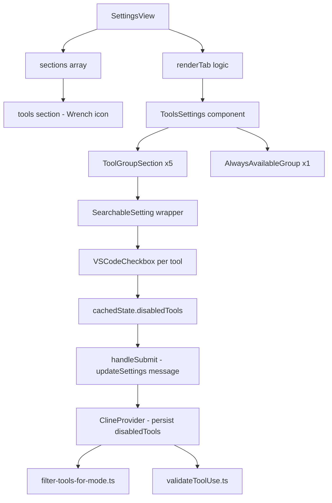

# Design: Disable Internal Tools

## Architecture Overview

This feature adds a new **Tools** section to the Settings window, providing a UI for the existing `disabledTools` backend setting. The design follows the established settings section pattern used by [`TerminalSettings`](../../webview-ui/src/components/settings/TerminalSettings.tsx), [`NotificationSettings`](../../webview-ui/src/components/settings/NotificationSettings.tsx), etc.



## Component Design

### New Component: `ToolsSettings`

File: `webview-ui/src/components/settings/ToolsSettings.tsx`

This component follows the same pattern as [`NotificationSettings`](../../webview-ui/src/components/settings/NotificationSettings.tsx):

```
Props:
  - disabledTools: string[]          // from cachedState
  - setCachedStateField: SetCachedStateField  // to update cachedState

Structure:
  <div>
    <SectionHeader> Tools </SectionHeader>
    <Section>
      <ToolGroupSection group=read />
      <ToolGroupSection group=edit />
      <ToolGroupSection group=command />
      <ToolGroupSection group=mcp />
      <ToolGroupSection group=modes />
      <AlwaysAvailableGroup />
    </Section>
  </div>
```

### Tool Checkbox Rendering

Each tool is rendered inside a [`SearchableSetting`](../../webview-ui/src/components/settings/SearchableSetting.tsx) wrapper:

```
<SearchableSetting
  settingId={`tools-${toolName}`}
  section="tools"
  label={displayName}>
  <VSCodeCheckbox
    checked={!disabledTools.includes(toolName)}
    onChange={(e) => toggleTool(toolName, e.target.checked)}>
    <span className="font-medium">{displayName}</span>
  </VSCodeCheckbox>
  {isCriticalTool && <WarningText />}
</SearchableSetting>
```

### State Toggle Logic

The toggle function updates `cachedState.disabledTools`:

```
toggleTool(toolName: string, enabled: boolean):
  if enabled:
    // Remove from disabledTools
    setCachedStateField("disabledTools", 
      cachedState.disabledTools?.filter(t => t !== toolName) ?? []
    )
  if !enabled:
    // Add to disabledTools
    setCachedStateField("disabledTools",
      [...(cachedState.disabledTools ?? []), toolName]
    )
```

This follows the AGENTS.md rule: inputs bind to `cachedState`, NOT the live `useExtensionState()`. The `setCachedStateField` call triggers `setChangeDetected(true)` automatically.

### Save Flow

The [`handleSubmit`](../../webview-ui/src/components/settings/SettingsView.tsx:349) function already sends an `updateSettings` message with all cached state fields. We need to add `disabledTools` to the `updatedSettings` object:

```
// In handleSubmit, add:
disabledTools: disabledTools ?? [],
```

The [`ClineProvider`](../../src/core/webview/ClineProvider.ts:2050) already handles `disabledTools` in its state reconciliation, so no backend changes are needed.

## Data Flow

### Tool Catalog Source

The tool catalog is defined in shared constants that are already available:

| Source | Purpose |
|--------|---------|
| [`toolNames`](../../packages/types/src/tool.ts:24) | Complete list of 24 tool names |
| [`TOOL_DISPLAY_NAMES`](../../src/shared/tools.ts:275) | Human-readable names for each tool |
| [`TOOL_GROUPS`](../../src/shared/tools.ts:304) | Group assignments: read, edit, command, mcp, modes |
| [`ALWAYS_AVAILABLE_TOOLS`](../../src/shared/tools.ts:325) | Tools always available across all modes |

These constants need to be exported/imported into the webview-ui package. Currently `TOOL_DISPLAY_NAMES` and `TOOL_GROUPS` are in `src/shared/tools.ts` which is the extension host code, not directly importable by webview-ui. We need to either:

1. **Option A**: Re-export these constants from `@roo-code/types` package (which webview-ui can import)
2. **Option B**: Define a parallel set of constants in the webview-ui that mirrors the backend

**Decision: Option A** — Export `TOOL_DISPLAY_NAMES`, `TOOL_GROUPS`, and `ALWAYS_AVAILABLE_TOOLS` from `@roo-code/types`. This is the cleanest approach since these are shared concepts. The `toolNames` array is already exported from `@roo-code/types`.

### Tool Group Configuration for UI

Create a typed configuration object that maps groups to their tools and display info:

```typescript
// In @roo-code/types or webview-ui shared utils
export const TOOL_GROUP_CONFIG = [
  { 
    groupKey: "read", 
    labelKey: "settings:tools.group.read",
    tools: ["read_file", "search_files", "list_files", "codebase_search"]
  },
  {
    groupKey: "edit",
    labelKey: "settings:tools.group.edit",
    tools: ["apply_diff", "write_to_file", "generate_image", "edit", "search_replace", "edit_file", "apply_patch"]
  },
  {
    groupKey: "command",
    labelKey: "settings:tools.group.command",
    tools: ["execute_command", "read_command_output"]
  },
  {
    groupKey: "mcp",
    labelKey: "settings:tools.group.mcp",
    tools: ["use_mcp_tool", "access_mcp_resource"]
  },
  {
    groupKey: "modes",
    labelKey: "settings:tools.group.modes",
    tools: ["switch_mode", "new_task", "async_task"]
  },
  {
    groupKey: "alwaysAvailable",
    labelKey: "settings:tools.group.alwaysAvailable",
    tools: ["ask_followup_question", "attempt_completion", "update_todo_list", "run_slash_command", "skill"],
    isAlwaysAvailable: true
  },
]
```

## Settings View Integration

### Section Registration

In [`SettingsView.tsx`](../../webview-ui/src/components/settings/SettingsView.tsx):

1. Add `"tools"` to [`sectionNames`](../../webview-ui/src/components/settings/SettingsView.tsx:98) array — position after `"modes"` and before `"autoApprove"`
2. Add `{ id: "tools", icon: Wrench }` to [`sections`](../../webview-ui/src/components/settings/SettingsView.tsx:496) array — same position
3. Import `Wrench` from `lucide-react`
4. Add `disabledTools` to the destructured `cachedState` fields
5. Add the render block: `{renderTab === "tools" && <ToolsSettings disabledTools={disabledTools ?? []} setCachedStateField={setCachedStateField} />}`
6. Add `disabledTools: disabledTools ?? []` to the `handleSubmit` `updatedSettings` object

### Section Order

The new `tools` section should be positioned between `modes` and `autoApprove`:

```
providers, modes, skills, slashCommands, tools, autoApprove, mcp, checkpoints, notifications, contextManagement, terminal, prompts, worktrees, ui, experimental, language, about
```

This places it near the top since it's a fundamental control over what capabilities Roo has.

## i18n Design

### Translation Keys

All new keys live under the `settings:` namespace in the i18n JSON files:

```json
{
  "settings": {
    "sections": {
      "tools": "Tools"
    },
    "tools": {
      "description": "Enable or disable internal tools to control what capabilities Roo has access to.",
      "group": {
        "read": "Read",
        "edit": "Edit",
        "command": "Command",
        "mcp": "MCP",
        "modes": "Modes",
        "alwaysAvailable": "Always Available"
      },
      "warning": {
        "critical": "Disabling this tool may significantly reduce Roo's ability to function properly."
      }
    }
  }
}
```

Tool display names will use the existing `TOOL_DISPLAY_NAMES` mapping rather than separate i18n keys, since these are technical tool names that should remain consistent across languages. However, if full i18n is desired, we can add `settings:tools.tool.<toolName>` keys that default to `TOOL_DISPLAY_NAMES` values.

## Critical Tool Warning Design

Two tools have special warning indicators:

- **`attempt_completion`** — Disabling this prevents Roo from signaling task completion
- **`ask_followup_question`** — Disabling this prevents Roo from asking clarifying questions

These tools show a small warning text below the checkbox:

```
<VSCodeCheckbox>...</VSCodeCheckbox>
<div className="text-vscode-descriptionForeground text-sm mt-0">
  <AlertTriangle className="w-3 h-3 inline mr-1 text-yellow-500" />
  {t("settings:tools.warning.critical")}
</div>
```

## File Changes Summary

| File | Change Type | Description |
|------|-------------|-------------|
| `webview-ui/src/components/settings/ToolsSettings.tsx` | **NEW** | Main Tools settings section component |
| `webview-ui/src/components/settings/SettingsView.tsx` | **MODIFY** | Add `tools` section, import Wrench, pass disabledTools prop, add to handleSubmit |
| `packages/types/src/tool.ts` | **MODIFY** | Export `TOOL_DISPLAY_NAMES` map, `TOOL_GROUPS`, `ALWAYS_AVAILABLE_TOOLS`, and `TOOL_GROUP_CONFIG` |
| `src/shared/tools.ts` | **MODIFY** | Remove or re-export duplicated constants if moved to types package |
| `locales/en/settings.json` | **MODIFY** | Add translation keys for tools section |
| `webview-ui/src/components/settings/__tests__/ToolsSettings.spec.tsx` | **NEW** | Unit tests for ToolsSettings component |

## Mermaid: Data Flow Diagram

```mermaid
flowchart LR
    subgraph Webview UI
        TS[ToolsSettings.tsx]
        SV[SettingsView.tsx]
        CS[cachedState.disabledTools]
    end

    subgraph Extension Host
        CP[ClineProvider.ts]
        FM[filter-tools-for-mode.ts]
        VT[validateToolUse.ts]
    end

    subgraph Types Package
        TN[toolNames]
        TD[TOOL_DISPLAY_NAMES]
        TG[TOOL_GROUPS]
        AA[ALWAYS_AVAILABLE_TOOLS]
    end

    TN --> TS
    TD --> TS
    TG --> TS
    AA --> TS

    TS --> CS
    CS --> SV
    SV -->|updateSettings message| CP
    CP -->|disabledTools state| FM
    CP -->|disabledTools state| VT
    FM -->|filtered tool list| API
    VT -->|validation check| Execution