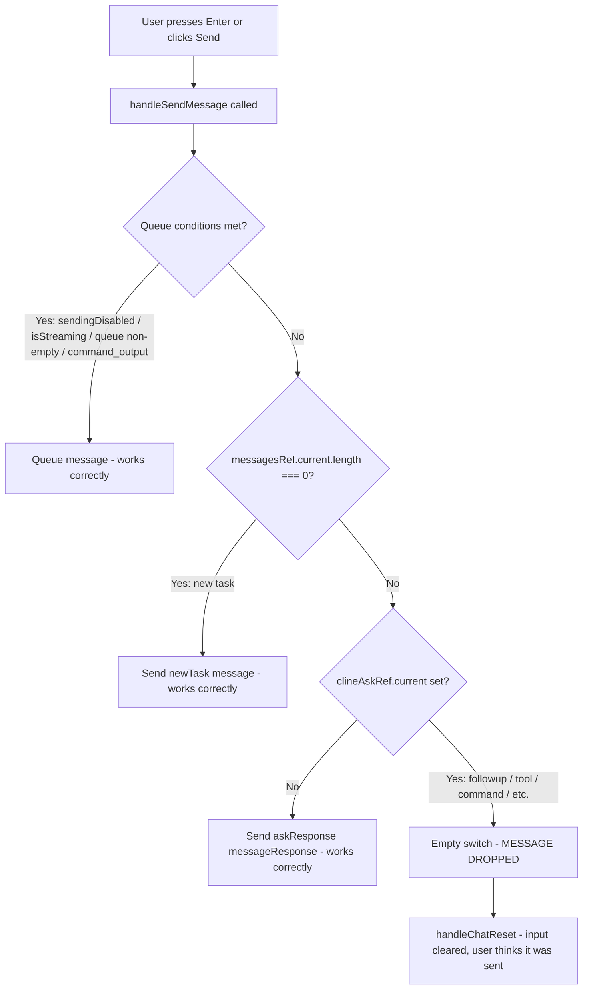
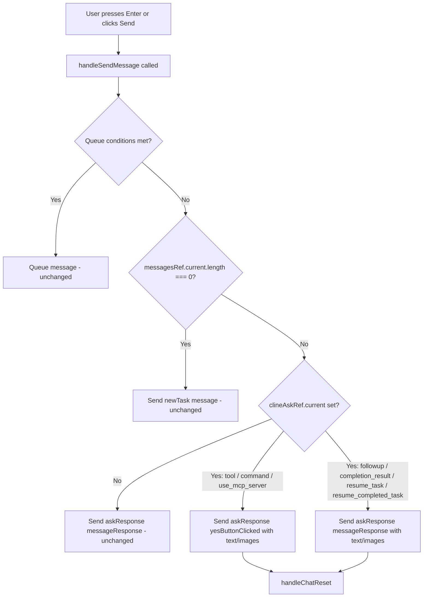

# Design: Double-Click Send Bug Fix

## Overview

Fix the empty `switch` statement in [`handleSendMessage`](webview-ui/src/components/chat/ChatView.tsx:621) that silently drops user messages when sent during an active ask (followup, tool, command, etc.).

## Current Behavior (Broken)



## Proposed Behavior (Fixed)



## Design Details

### Change 1: Fill in the switch statement in `handleSendMessage`

**File**: [`ChatView.tsx`](webview-ui/src/components/chat/ChatView.tsx:621)

Replace the empty switch cases (lines 621-632) with actual message-sending logic that mirrors the backend drain pattern in [`Task.ts`](src/core/task/Task.ts:1375-1388):

```typescript
switch (clineAskRef.current) {
    case "tool":
    case "command":
    case "use_mcp_server":
        // User is approving the tool/command with additional feedback text
        vscode.postMessage({
            type: "askResponse",
            askResponse: "yesButtonClicked",
            text,
            images,
        })
        break
    case "followup":
    case "completion_result":
    case "resume_task":
    case "resume_completed_task":
        // User is responding to the question with a message
        vscode.postMessage({
            type: "askResponse",
            askResponse: "messageResponse",
            text,
            images,
        })
        break
}
```

**Key design decision**: The ask type determines the response type, matching the backend pattern:
- Tool/command/use_mcp_server asks → `yesButtonClicked` (user approves + provides feedback)
- Followup/completion_result/resume asks → `messageResponse` (user provides conversational response)

This is consistent with how [`handlePrimaryButtonClick`](webview-ui/src/components/chat/ChatView.tsx:694) already works for button clicks, and how the backend [`Task.ask()`](src/core/task/Task.ts:1375) drains queued messages.

### Change 2: Preserve `markFollowUpAsAnswered()` call

The existing `markFollowUpAsAnswered()` call at line 616-618 (before the switch) must remain. It handles UI state for follow-up question highlighting. The switch case for `followup` sends the backend message — both are needed.

### No other changes needed

- The queuing path (lines 590-607) is correct and unchanged
- The new task path (line 614) is correct and unchanged  
- The no-ask path (lines 633-636) is correct and unchanged
- `handleChatReset()` at line 638 is correct — it should still be called after sending

## Test Strategy

Add test cases to [`ChatView.spec.tsx`](webview-ui/src/components/chat/__tests__/ChatView.spec.tsx) covering:

1. **Sending message during followup ask** — verify `askResponse: "messageResponse"` is sent with text/images
2. **Sending message during tool ask** — verify `askResponse: "yesButtonClicked"` is sent with text/images
3. **Sending message during command ask** — verify `askResponse: "yesButtonClicked"` is sent with text/images
4. **Sending message during use_mcp_server ask** — verify `askResponse: "yesButtonClicked"` is sent with text/images
5. **Sending message during completion_result ask** — verify `askResponse: "messageResponse"` is sent with text/images
6. **Queuing still works** — verify that when `sendingDisabled` or `isStreaming`, messages are still queued (not sent directly)