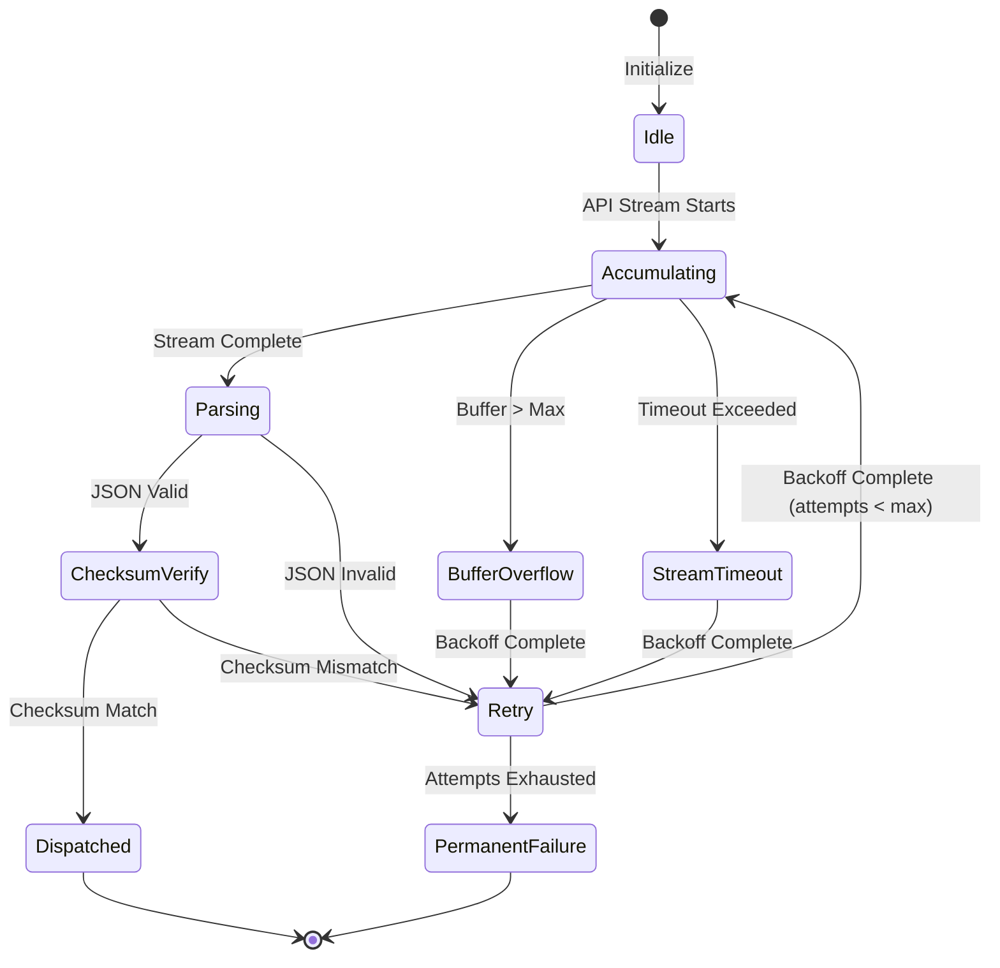

# Design Document - Multi-Agent Architecture with JSON-First Communication Protocol

## Overview

The Multi-Agent Architecture with JSON-First Communication Protocol enhances the existing swarm architecture (defined in `.roo/specs/swarm-architecture/`) with a reliable, verifiable messaging layer. The core innovation is replacing the fragile streaming JSON parsing for inter-agent communication with a structured JSON envelope protocol that includes SHA-256 checksums, enabling workers to verify message completeness before acting on it.

This design introduces three new components — `JsonStreamBuffer`, `ChecksumVerifier`, and `AgentMessageDispatcher` — that work together to form a **streaming harness** between the LLM API and the agent communication layer. These components integrate with the existing swarm infrastructure (`SpawnManager`, `ChannelManager`, `PlanManager`, `AsyncSubtaskManager`) without requiring changes to the existing `NativeToolCallParser` streaming approach for within-agent tool calls.

### Problem Statement

The existing streaming infrastructure in `NativeToolCallParser` (line 53) accumulates JSON argument chunks via `processStreamingChunk()` and uses `partial-json` to parse incomplete JSON. This approach works for within-agent tool calls where the tool execution layer can handle partial results gracefully. However, for inter-agent communication, partial parsing is fundamentally unreliable:

- **Silently dropped tool calls**: When `finalizeStreamingToolCall()` (line 294) returns null for an unclosed tool call, the task assignment is lost with no error.
- **Garbage arguments**: `partial-json` may produce syntactically valid but semantically nonsensical arguments from truncated input.
- **Orphaned tool_use blocks**: When `finalizeRawChunks()` (line 189) emits end events for unclosed tool calls, the receiving agent gets tool_use blocks with no matching tool_result.

### Solution Architecture

The solution introduces a protocol layer that sits between the LLM API and the agent communication layer:

```
LLM API Stream -> JsonStreamBuffer -> ChecksumVerifier -> AgentMessageDispatcher -> Worker Agent
```

For within-agent tool calls, the existing `NativeToolCallParser` streaming approach is unchanged.

## Architecture

### Component Diagram

```
┌─────────────────────────────────────────────────────────────────────────────────┐
│                         Multi-Agent Communication System                         │
│                                                                                 │
│  ┌──────────────────────────────────────────────────────────────────────────┐  │
│  │                        Coordinator Agent                                  │  │
│  │  (src/core/swarm/coordinator/spawn-manager.ts)                           │  │
│  │                                                                          │  │
│  │  ┌─────────────────────┐     ┌──────────────────────────────────────┐   │  │
│  │  │  Task Assignment    │────>│  AgentMessageBuilder                  │   │  │
│  │  │  Logic              │     │  (constructs AgentMessage envelope)  │   │  │
│  │  └─────────────────────┘     └──────────────┬───────────────────────┘   │  │
│  │                                              │                           │  │
│  │                                              ▼                           │  │
│  │                                   ┌──────────────────────┐              │  │
│  │                                   │  ChecksumComputer    │              │  │
│  │                                   │  (SHA-256 of payload)│              │  │
│  │                                   └──────────┬───────────┘              │  │
│  │                                              │                           │  │
│  │                                              ▼                           │  │
│  │  ┌──────────────────────────────────────────────────────────────────┐  │  │
│  │  │              AgentMessageDispatcher                              │  │  │
│  │  │  (routes validated messages to workers via ChannelManager)       │  │  │
│  │  └──────────────────────────────────────────────────────────────────┘  │  │
│  └──────────────────────────────────────────────────────────────────────────┘  │
│                                      │                                          │
│                          ┌───────────┴───────────┐                              │
│                          │  ChannelManager        │                              │
│                          │  (existing, unchanged) │                              │
│                          │  src/core/swarm/daemon/ │                              │
│                          │  channel-manager.ts     │                              │
│                          └───────────┬───────────┘                              │
│                                      │                                          │
│  ┌───────────────────────────────────┼───────────────────────────────────────┐  │
│  │                        Worker Agent                                       │  │
│  │                                                                           │  │
│  │  ┌─────────────────────────────────────────────────────────────────────┐ │  │
│  │  │                    Streaming Harness                                 │ │  │
│  │  │                                                                     │ │  │
│  │  │  ┌──────────────────┐    ┌──────────────────┐    ┌──────────────┐ │ │  │
│  │  │  │  JsonStreamBuffer │───>│  ChecksumVerifier │───>│  AgentMessage │ │ │  │
│  │  │  │                   │    │                   │    │  Dispatcher   │ │ │  │
│  │  │  │  Accumulates     │    │  Verifies SHA-256 │    │  (routes to   │ │ │  │
│  │  │  │  complete stream │    │  checksum         │    │   handlers)   │ │ │  │
│  │  │  └──────────────────┘    └──────────────────┘    └──────┬───────┘ │ │  │
│  │  │                                                         │         │ │  │
│  │  │  ┌──────────────────────────────────────────────────────┘         │ │  │
│  │  │  │                                                                │ │  │
│  │  │  │  ┌─────────────────┐  ┌─────────────────┐  ┌───────────────┐ │ │  │
│  │  │  │> │ Task Assignment │  │ Plan Approval   │  │ Conflict      │ │ │  │
│  │  │  │  │ Handler         │  │ Handler         │  │ Handler       │ │ │  │
│  │  │  │  └─────────────────┘  └─────────────────┘  └───────────────┘ │ │  │
│  │  │  └────────────────────────────────────────────────────────────────│ │  │
│  │  └─────────────────────────────────────────────────────────────────────┘ │  │
│  │                                                                           │  │
│  │  ┌─────────────────────────────────────────────────────────────────────┐ │  │
│  │  │  Response Path (Worker -> Coordinator)                              │ │  │
│  │  │                                                                     │ │  │
│  │  │  Task Result ──> AgentMessageBuilder ──> ChecksumComputer ──> Send │ │  │
│  │  └─────────────────────────────────────────────────────────────────────┘ │  │
│  └───────────────────────────────────────────────────────────────────────────┘  │
│                                                                                 │
│  ┌──────────────────────────────────────────────────────────────────────────┐  │
│  │                     Existing Infrastructure (unchanged)                   │  │
│  │                                                                          │  │
│  │  NativeToolCallParser  AsyncSubtaskManager  PlanManager  PlanInfoWidget │  │
│  │  (within-agent)        (subtask lifecycle)   (plan state)  (UI)         │  │
│  └──────────────────────────────────────────────────────────────────────────┘  │
└─────────────────────────────────────────────────────────────────────────────────┘
```

### Component Descriptions

#### 1. JsonStreamBuffer (New Component)

The `JsonStreamBuffer` accumulates the complete streaming response from an LLM API call before attempting to parse it as a structured AgentMessage. It replaces the partial-parse approach for inter-agent communication.

**Responsibilities:**
- Accumulate streaming chunks into a single string buffer
- Signal when the stream is complete (API stream ends)
- Attempt JSON parse of the complete buffer
- Enforce buffer size limits and stream timeouts
- Emit events for success, failure, overflow, and timeout

**Location:** `src/core/swarm/protocol/JsonStreamBuffer.ts`

#### 2. ChecksumVerifier (New Component)

The `ChecksumVerifier` computes and verifies SHA-256 checksums of AgentMessage payloads to detect incomplete or corrupted messages.

**Responsibilities:**
- Compute SHA-256 hash of canonical JSON payload
- Verify received message checksums against recomputed values
- Provide canonical JSON serialization (sorted keys, no whitespace)
- Complete verification in under 5ms per message

**Location:** `src/core/swarm/protocol/ChecksumVerifier.ts`

#### 3. AgentMessageDispatcher (New Component)

The `AgentMessageDispatcher` routes validated AgentMessage envelopes between agents via the existing `ChannelManager` and `Daemon` infrastructure.

**Responsibilities:**
- Route outgoing AgentMessage envelopes to the correct recipient
- Ingest incoming AgentMessage envelopes from the ChannelManager
- Integrate with the existing `ChannelManager` for message delivery
- Handle protocol version routing (JSON-first vs. legacy)

**Location:** `src/core/swarm/protocol/AgentMessageDispatcher.ts`

#### 4. Existing Components (Unchanged)

- **NativeToolCallParser** (`src/core/assistant-message/NativeToolCallParser.ts`): Continues to handle within-agent tool call streaming with `partial-json`. Unchanged.
- **AsyncSubtaskManager** (`src/core/subtasks/AsyncSubtaskManager.ts`): Continues to manage subtask lifecycle. Enhanced to use AgentMessage when target supports protocol.
- **SpawnManager** (`src/core/swarm/coordinator/spawn-manager.ts`): Continues to spawn agents. Enhanced to pass protocol version to spawned agents.
- **ChannelManager** (`src/core/swarm/daemon/channel-manager.ts`): Continues to manage communication channels. AgentMessage envelopes are transmitted as channel messages.
- **PlanManager** (`src/core/swarm/daemon/plan-manager.ts`): Continues to manage plan state. Plan updates via AgentMessage update the plan state.
- **PlanInfoWidget** (`webview-ui/src/components/swarm/PlanInfoWidget.tsx`): Continues to display plan state. Updates from AgentMessage are reflected in the UI.

## Data Structures

### AgentMessage Envelope

```typescript
export const agentMessagePayloadSchema = z.discriminatedUnion("type", [
  z.object({
    type: z.literal("task_assignment"),
    task: z.object({
      taskId: z.string(),
      description: z.string(),
      owner: z.string().optional(),
      scope: z.string().optional(),
      status: z.enum(["pending", "in_progress", "blocked", "completed", "failed"]),
      dependsOn: z.array(z.string()),
      checkpoints: z.array(z.object({
        checkpointId: z.string(),
        description: z.string(),
        status: z.enum(["pending", "completed", "failed"]),
      })),
    }),
    context: z.string(),
    dependencies: z.array(z.string()),
  }),
  z.object({
    type: z.literal("task_result"),
    taskId: z.string(),
    outcome: z.enum(["success", "failure", "partial"]),
    changes: z.array(z.object({
      filePath: z.string(),
      operation: z.enum(["create", "modify", "delete"]),
      diff: z.string().optional(),
      linesAdded: z.number().optional(),
      linesRemoved: z.number().optional(),
    })),
    validation: z.array(z.object({
      checkName: z.string(),
      status: z.enum(["passed", "failed", "skipped"]),
      message: z.string().optional(),
    })),
    blockers: z.array(z.object({
      blockerId: z.string(),
      type: z.enum(["dependency", "conflict", "resource", "external"]),
      description: z.string(),
    })),
  }),
  z.object({
    type: z.literal("plan_update"),
    planId: z.string(),
    version: z.number(),
    changes: z.array(z.object({
      changeType: z.enum(["add_task", "modify_task", "remove_task", "add_dependency", "remove_dependency", "update_scope"]),
      targetId: z.string(),
      before: z.any().optional(),
      after: z.any().optional(),
      description: z.string(),
    })),
    reason: z.string(),
  }),
  z.object({
    type: z.literal("plan_approval"),
    updateId: z.string(),
    approved: z.boolean(),
    reason: z.string(),
  }),
  z.object({
    type: z.literal("message"),
    content: z.string(),
    channel: z.string().optional(),
  }),
  z.object({
    type: z.literal("conflict_notification"),
    filePath: z.string(),
    conflictingAgent: z.string(),
    resolution: z.string(),
  }),
])

export type AgentMessagePayload = z.infer<typeof agentMessagePayloadSchema>

export const agentMessageSchema = z.object({
  protocol: z.string().regex(/^roo-agent\/v\d+$/, "Protocol must match pattern roo-agent/v<N>"),
  id: z.string().uuid(),
  sender: z.string(),
  recipient: z.string(),
  timestamp: z.number(),
  payload: agentMessagePayloadSchema,
  checksum: z.string().regex(/^[a-f0-9]{64}$/, "Checksum must be a 64-character SHA-256 hex digest"),
})

export type AgentMessage = z.infer<typeof agentMessageSchema>
```

### Canonical JSON and Checksum

```typescript
/**
 * Produces a deterministic JSON representation for checksum computation.
 * - All object keys sorted alphabetically (Unicode code point order)
 * - No whitespace outside of string values
 * * Numbers represented in their parsed form
 */
export function canonicalize(value: unknown): string {
  if (value === null || value === undefined) return "null"
  if (typeof value === "string") return JSON.stringify(value)
  if (typeof value === "number" || typeof value === "boolean") return String(value)
  if (Array.isArray(value)) {
    return "[" + value.map(canonicalize).join(",") + "]"
  }
  if (typeof value === "object") {
    const sortedKeys = Object.keys(value as Record<string, unknown>()).sort()
    return "{" + sortedKeys.map(k => JSON.stringify(k) + ":" + canonicalize((value as Record<string, unknown>)[k])).join(",") + "}"
  }
  return "null"
}

/**
 * Computes SHA-256 hex digest of the canonical JSON representation.
 */
export function computeChecksum(payload: AgentMessagePayload): string {
  const canonical = canonicalize(payload)
  return sha256(canonical) // Uses Node.js crypto module
}
```

### JsonStreamBuffer State

```typescript
export interface JsonStreamBufferConfig {
  maxBufferSizeBytes: number    // Default: 10MB (10 * 1024 * 1024)
  streamTimeoutMs: number       // Default: 300 seconds (300 * 1000)
}

export type JsonStreamBufferState =
  | { status: "accumulating"; bytesReceived: number }
  | { status: "complete"; buffer: string }
  | { status: "parse_success"; message: AgentMessage }
  | { status: "parse_failure"; buffer: string; error: string }
  | { status: "buffer_overflow"; bytesReceived: number }
  | { status: "stream_timeout"; buffer: string; durationMs: number }
  | { status: "checksum_verified"; message: AgentMessage }
  | { status: "checksum_failed"; message: AgentMessage; expectedChecksum: string; actualChecksum: string }
```

### Retry Configuration

```typescript
export const jsonFirstConfigSchema = z.object({
  enabled: z.boolean().optional().default(false),
  retryAttempts: z.number().int().min(1).max(10).optional().default(3),
  retryBaseDelayMs: z.number().int().min(100).max(30000).optional().default(1000),
  maxBufferSizeBytes: z.number().int().min(1024).max(104857600).optional().default(10485760),
  streamTimeoutMs: z.number().int().min(1000).max(600000).optional().default(300000),
  protocolVersion: z.string().optional().default("roo-agent/v1"),
})

export type JsonFirstConfig = z.infer<typeof jsonFirstConfigSchema>
```

### Retry State Machine



## Algorithms

### 1. Checksum Computation Algorithm

**Purpose:** Produce a deterministic, verifiable hash of an AgentMessage payload.

```
function computeChecksum(payload: AgentMessagePayload): string {
  // Step 1: Canonicalize the payload
  const canonical = canonicalize(payload)
  // canonicalize() produces:
  //   - Sorted object keys (Unicode code point order)
  //   - No whitespace outside string values
  //   - Numbers in parsed form (no trailing zeros)
  
  // Step 2: Compute SHA-256 hash
  const hash = crypto.createHash("sha256").update(canonical, "utf-8").digest("hex")
  
  // Step 3: Return 64-character hex string
  return hash
}

function verifyChecksum(payload: AgentMessagePayload, expectedChecksum: string): boolean {
  const actualChecksum = computeChecksum(payload)
  return timingSafeEqual(Buffer.from(actualChecksum), Buffer.from(expectedChecksum))
}
```

**Timing-safe comparison** is used to prevent timing attacks on checksum verification, even though checksums are not secret.

### 2. Buffer Accumulation Algorithm

**Purpose:** Accumulate the complete streaming response before parsing.

```
class JsonStreamBuffer {
  private buffer = ""
  private bytesReceived = 0
  private startTime = Date.now()
  private timeoutId: NodeJS.Timeout | null = null

  constructor(config: JsonStreamBufferConfig) {
    this.maxBufferSizeBytes = config.maxBufferSizeBytes
    this.streamTimeoutMs = config.streamTimeoutMs
  }

  startStream(): void {
    this.buffer = ""
    this.bytesReceived = 0
    this.startTime = Date.now()
    
    // Set up timeout watchdog
    this.timeoutId = setTimeout(() => {
      if (this.status === "accumulating") {
        this.emit("stream_timeout", {
          buffer: this.buffer,
          durationMs: this.streamTimeoutMs,
        })
      }
    }, this.streamTimeoutMs)
  }

  processChunk(chunk: string): void {
    const chunkBytes = Buffer.byteLength(chunk, "utf-8")
    
    // Check buffer overflow BEFORE appending
    if (this.bytesReceived + chunkBytes > this.maxBufferSizeBytes) {
      if (this.timeoutId) clearTimeout(this.timeoutId)
      this.emit("buffer_overflow", { bytesReceived: this.bytesReceived + chunkBytes })
      return
    }
    
    this.buffer += chunk
    this.bytesReceived += chunkBytes
    this.emit("chunk_received", { bytesReceived: this.bytesReceived })
  }

  completeStream(): void {
    if (this.timeoutId) clearTimeout(this.timeoutId)
    
    if (this.bytesReceived === 0) {
      this.emit("parse_failure", { buffer: "", error: "Empty stream received" })
      return
    }
    
    this.emit("stream_complete", { buffer: this.buffer })
    
    // Attempt JSON parse
    try {
      const parsed = JSON.parse(this.buffer)
      this.emit("parse_success", { message: parsed })
    } catch (error) {
      this.emit("parse_failure", { buffer: this.buffer, error: error.message })
    }
  }
}
```

### 3. Retry with Exponential Backoff Algorithm

**Purpose:** Automatically retry failed message deliveries with exponential backoff.

```
class RetryHandler {
  private attemptCount = 0
  private config: JsonFirstConfig

  constructor(config: JsonFirstConfig) {
    this.config = config
  }

  async executeWithRetry<T>(operation: () => Promise<T>): Promise<T> {
    this.attemptCount = 0
    
    while (this.attemptCount < this.config.retryAttempts) {
      try {
        const result = await operation()
        this.attemptCount = 0  // Reset on success
        return result
      } catch (error) {
        this.attemptCount++
        
        if (this.attemptCount >= this.config.retryAttempts) {
          this.logPermanentFailure(error)
          throw new Error(`Permanent failure after ${this.config.retryAttempts} attempts: ${error.message}`)
        }
        
        const delay = this.calculateBackoff(this.attemptCount)
        this.logRetry(this.attemptCount, error, delay)
        await sleep(delay)
      }
    }
  }

  private calculateBackoff(attempt: number): number {
    // Exponential backoff: baseDelay * 2^(attempt-1)
    // With jitter: multiply by random factor [0.5, 1.5]
    const exponential = this.config.retryBaseDelayMs * Math.pow(2, attempt - 1)
    const jitter = 0.5 + Math.random()  // Range: [0.5, 1.5]
    return Math.min(exponential * jitter, 60000)  // Cap at 60 seconds
  }
}
```

### 4. Message Dispatch Algorithm

**Purpose:** Route validated AgentMessage envelopes to the correct recipient via existing infrastructure.

```
class AgentMessageDispatcher {
  private channelManager: ChannelManager
  private checksumVerifier: ChecksumVerifier
  private protocolVersion: string

  constructor(channelManager: ChannelManager, protocolVersion: string) {
    this.channelManager = channelManager
    this.checksumVerifier = new ChecksumVerifier()
    this.protocolVersion = protocolVersion
  }

  async send(message: AgentMessage): Promise<void> {
    // Step 1: Verify protocol version matches
    if (message.protocol !== this.protocolVersion) {
      throw new ProtocolVersionMismatchError(message.protocol, this.protocolVersion)
    }

    // Step 2: Verify checksum before sending (defense in depth)
    if (!this.checksumVerifier.verify(message.payload, message.checksum)) {
      throw new ChecksumMismatchError("Cannot send message with invalid checksum")
    }

    // Step 3: Route based on recipient
    if (message.recipient === "broadcast") {
      await this.channelManager.broadcast(message.sender, JSON.stringify(message))
    } else {
      await this.channelManager.sendDM(message.sender, message.recipient, JSON.stringify(message))
    }

    // Step 4: Log dispatch
    this.logDispatch(message)
  }

  async receive(rawMessage: string): Promise<AgentMessage> {
    // Step 1: Parse JSON
    let parsed: unknown
    try {
      parsed = JSON.parse(rawMessage)
    } catch (error) {
      throw new MessageParseError(`Invalid JSON: ${error.message}`)
    }

    // Step 2: Validate schema
    const result = agentMessageSchema.safeParse(parsed)
    if (!result.success) {
      throw new MessageValidationError(`Schema validation failed: ${result.error.message}`)
    }

    const message = result.data

    // Step 3: Verify checksum
    if (!this.checksumVerifier.verify(message.payload, message.checksum)) {
      throw new ChecksumMismatchError(
        `Checksum mismatch for message ${message.id}: ` +
        `expected ${message.checksum}, got ${this.checksumVerifier.compute(message.payload)}`
      )
    }

    return message
  }
}
```

### 5. Protocol Version Routing Algorithm

**Purpose:** Determine whether to use JSON-first or legacy communication for each worker.

```
function determineCommunicationProtocol(
  workerId: string,
  workerSupportedProtocols: string[],
  globalConfig: JsonFirstConfig,
): "json-first" | "legacy" {
  // Step 1: Check if JSON-first is globally enabled
  if (!globalConfig.enabled) {
    return "legacy"
  }

  // Step 2: Check if worker supports the current protocol version
  if (workerSupportedProtocols.includes(globalConfig.protocolVersion)) {
    return "json-first"
  }

  // Step 3: Fall back to legacy
  return "legacy"
}
```

## Integration Points

### 1. NativeToolCallParser (`src/core/assistant-message/NativeToolCallParser.ts`)

**No changes required.** The existing streaming infrastructure for within-agent tool calls is unchanged. The JSON-first protocol operates at a higher level — between the LLM API response and the agent communication layer.

**Key existing methods that remain unchanged:**
- `processStreamingChunk()` (line 53): Continues to accumulate JSON argument chunks for within-agent tool calls
- `streamingToolCalls` Map (line 56): Continues to track active streaming tool calls
- `rawChunkTracker` Map (line 66): Continues to track raw chunk state
- `finalizeStreamingToolCall()` (line 294): Continues to finalize accumulated JSON for within-agent tool calls
- `processRawChunk()` (line 99): Continues to process raw tool call chunks
- `finalizeRawChunks()` (line 189): Continues to emit end events for unclosed tool calls

**New integration:** The `JsonStreamBuffer` wraps the API stream **before** it reaches `NativeToolCallParser` when the stream is destined for inter-agent communication. For within-agent reasoning, the stream flows directly to `NativeToolCallParser` as before.

### 2. AsyncSubtaskManager (`src/core/subtasks/AsyncSubtaskManager.ts`)

**Enhancement:** The `spawnSubtasks()` method (line 70) is enhanced to use AgentMessage when the target supports the protocol.

**Integration points:**
- `AsyncSubtaskSpec` interface (line 9): Extended with optional `protocolVersion` field
- `SpawnSubtasksParams` interface (line 15): Extended with optional `protocolVersion` field
- `AsyncSubtaskStatus` interface (line 20): Extended with optional `supportedProtocols` field
- `spawnSubtasks()` (line 70): Uses `determineCommunicationProtocol()` to choose between JSON-first and legacy communication
- `MergeResult` type (line 44): Unchanged — merge logic is independent of communication protocol

### 3. SpawnManager (`src/core/swarm/coordinator/spawn-manager.ts`)

**Enhancement:** Spawned agents receive the protocol version they should use.

**Integration points:**
- `SpawnManager` constructor (line 20): Accepts `protocolVersion` parameter
- `spawnAgentsForPlan()` (line 38): Passes protocol version to spawned agents
- `SpawnResult` interface (line 11): Extended with `protocolVersion` field

### 4. ChannelManager (`src/core/swarm/daemon/channel-manager.ts`)

**No changes required.** AgentMessage envelopes are transmitted as regular channel messages (JSON strings). The `ChannelManager` does not need to understand the message format.

**Integration points:**
- `ChannelManager` (line 8): AgentMessage envelopes are sent/received as channel message content
- `sendDM()`: Used for point-to-point AgentMessage delivery
- `sendToChannel()`: Used for broadcast AgentMessage delivery

### 5. PlanManager (`src/core/swarm/daemon/plan-manager.ts`)

**No changes required.** Plan updates received via AgentMessage are decoded and applied using the existing `updateTaskStatus()` and `addPlanUpdateToHistory()` methods.

**Integration points:**
- `PlanManager` (line 8): Receives plan updates from AgentMessage payloads
- `updateTaskStatus()` (line 27): Called when a `plan_update` AgentMessage is processed
- `addPlanUpdateToHistory()` (line 40): Called when a plan update is approved

### 6. PlanInfoWidget (`webview-ui/src/components/swarm/PlanInfoWidget.tsx`)

**No changes required.** The widget receives plan state from the PlanManager, which is updated regardless of whether the update came via AgentMessage or legacy communication.

**Integration points:**
- `PlanInfoWidget` (line 34): Receives plan state from the extension backend
- Plan state updates flow through the existing message passing infrastructure

### 7. Task Error Handling (`src/core/task/Task.ts`)

**Integration points:**
- `recordToolError()` (line 4512): Used to log AgentMessage-related errors (checksum failures, parse errors)
- `MissingToolResultError` (`src/core/task/validateToolResultIds.ts`, line 24): Pattern for creating protocol-specific error types
- `ToolResultIdMismatchError` (`src/core/task/validateToolResultIds.ts`, line 8): Pattern for creating protocol-specific error types

### 8. Zod Schema Patterns (`packages/types/src/`)

**Integration points:**
- `modeConfigSchema` in `packages/types/src/mode.ts` (line 96): Reference pattern for complex Zod schemas with `.optional().default()`
- `globalSettingsSchema` pattern: New `jsonFirst` section added with `.optional().default()` for all fields

## Performance Constraints

- **Checksum computation**: Must complete in under 5ms per message for payloads up to 1MB. SHA-256 on modern hardware processes ~500MB/s, so 1MB takes ~2ms.
- **Buffer accumulation**: Memory-bounded by `maxBufferSizeBytes` (default 10MB). No performance constraint — accumulation is I/O-bound.
- **JSON parsing**: Must complete in under 10ms for payloads up to 1MB. V8 JSON.parse handles ~100MB/s, so 1MB takes ~10ms.
- **Schema validation**: Must complete in under 5ms for payloads up to 1MB. Zod validation is typically 2-3x faster than JSON parsing.
- **Total overhead**: The streaming harness adds ~20ms of latency to inter-agent message delivery (checksum + parse + validation). This is negligible compared to LLM API latency (typically 1-30 seconds).
- **No additional API calls**: The JSON-first protocol does not make any additional LLM or network calls. It operates on the existing API stream.
- **Memory**: Each active inter-agent communication holds at most `maxBufferSizeBytes` (default 10MB) in memory. With 100 concurrent agents, worst case is 1GB — acceptable for a development tool.
- **Retry backoff**: Exponential backoff with jitter prevents thundering herd. Maximum backoff capped at 60 seconds.
