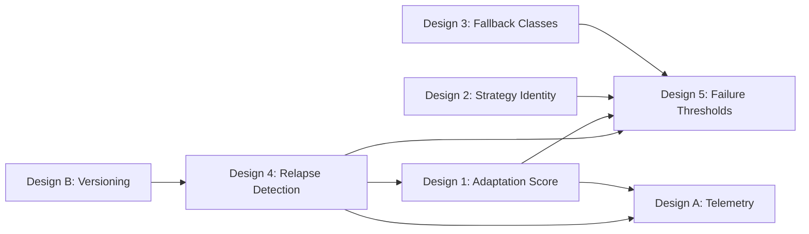

# Phase 4C Architectural Fixes — Design

## Overview

This document specifies the exact changes to apply to Section 9 of [`phase-4-architecture.md`](../semantic-loop-detection/phase-4-architecture.md) (lines 1173–1441). Changes are ordered by dependency: Issue #4 (Relapse Detection) first, then Issues 1, 2, 3, 5, and the additional fixes.

Each change specifies the **target section**, **current content**, and **replacement content** for the architecture document.

---

## Design Order



---

## Design 4: Relapse Detection (Foundational)

### 4.1 New Section: 9.3.3 `RelapseEvent` Interface

**Insert after** the current 9.3.2 `InterventionEffectivenessTracker` section (after line 1248), before the `---` separator.

**New content:**

```markdown
#### 9.3.3 `RelapseEvent` Interface

A new interface to track when an agent recovers from a loop and then falls back into a similar one:

```typescript
// New type in packages/types/src/loop-detection.ts
export interface RelapseEvent {
    /** ID of the compression that originally resolved the loop */
    originalCompressionId: string
    /** Number of turns between recovery and relapse */
    turnsSinceRecovery: number
    /** Similarity score between the new loop and the original loop (0.0–1.0) */
    similarityToOriginalLoop: number
    /** Timestamp of the relapse detection */
    timestamp: number
}
```
```

### 4.2 New Section: 9.3.4 `RelapseDetector`

**Insert after** 9.3.3, still within Section 9.3.

**New content:**

```markdown
#### 9.3.4 `RelapseDetector`

A new module that watches for the pattern `loop → intervention → recovery → same loop` and emits `RelapseDetected` signals:

```typescript
// New module in src/core/loop-detection/RelapseDetector.ts
export default class RelapseDetector {
    private recentRelapses: RelapseEvent[]
    private config: {
        /** Minimum similarity to consider a new loop a relapse of an old one. Default: 0.7 */
        relapseSimilarityThreshold: number
        /** Minimum turns since recovery before checking for relapse. Default: 2 */
        minTurnsSinceRecovery: number
        /** Maximum number of relapse events to retain. Default: 20 */
        maxRelapses: number
    }

    /** Called when a loop is detected after a previous recovery */
    checkForRelapse(
        currentLoopSignature: string,
        compressionHistory: CompressionRecord[]
    ): RelapseEvent | null

    /** Get all recent relapse events */
    getRecentRelapses(): RelapseEvent[]

    /** Check if a specific intervention outcome has relapsed */
    hasRelapsed(interventionId: string): boolean
}
```

**Detection Algorithm:**

1. When a new loop is detected (via Phase 1-3 `SemanticLoopDetector`), extract the loop signature.
2. Search `compressionHistory` for compressions that resolved a loop with a similar signature (similarity ≥ `relapseSimilarityThreshold`).
3. If found, compute `turnsSinceRecovery` = current turn index − compression turn index.
4. If `turnsSinceRecovery ≥ minTurnsSinceRecovery`, emit a `RelapseEvent`.
5. The `RelapseEvent` feeds into `InterventionOutcome.relapsed` (Design 1) and `AdaptationFailureDetector` (Design 5).

**Loop signature reuse:** The `currentLoopSignature` uses the same similarity metric that Phase 1-3 `SemanticLoopDetector` already computes (turn-pair similarity based on tool pattern, file overlap, and text similarity). No new similarity logic is needed.
```

---

## Design 1: Adaptation Score Fix

### 1.1 Modify `InterventionOutcome` Interface (Section 9.3.1)

**Target:** Lines 1200–1220 (the `InterventionOutcome` interface)

**Current `InterventionOutcome`:**

```typescript
export interface InterventionOutcome {
    interventionId: string
    interventionType: "compression" | "feedback_injection" | "strategy_switch" | "tool_fallback"
    progressBefore: number
    progressAfter: number
    recovered: boolean
    timestamp: number
    filesModified: string[]
    toolsUsed: string[]
}
```

**Replacement:**

```typescript
export interface InterventionOutcome {
    /** Unique ID for this intervention */
    interventionId: string
    /** Type of intervention applied */
    interventionType: "compression" | "feedback_injection" | "strategy_switch" | "tool_fallback"
    /** Progress score before intervention */
    progressBefore: number
    /** Progress score after intervention */
    progressAfter: number
    /** Whether the intervention led to immediate recovery (progressAfter > progressBefore + threshold) */
    recovered: boolean
    /** Number of turns after intervention where progress remained above threshold */
    recoveryTurns: number
    /** Whether the agent relapsed into a similar loop after apparent recovery */
    relapsed: boolean
    /** Timestamp of the relapse, if applicable */
    relapseTimestamp?: number
    /** Timestamp of the intervention */
    timestamp: number
    /** Files modified during the intervention */
    filesModified: string[]
    /** Tools used during the intervention */
    toolsUsed: string[]
}
```

### 1.2 Modify Algorithm Description (Section 9.3.2)

**Target:** Lines 1244–1248 (the algorithm block after `InterventionEffectivenessTracker`)

**Current:**

```markdown
**Algorithm:**
- After each intervention, record the `InterventionOutcome` with `progressBefore`, `progressAfter`, and `recovered` status.
- `recovered` is true if `progressAfter > progressBefore + recoveryThreshold`.
- The `adaptationScore` is computed as the percentage of interventions that led to recovery.
```

**Replacement:**

```markdown
**Algorithm:**
- After each intervention, record the `InterventionOutcome` with `progressBefore`, `progressAfter`, `recovered`, `recoveryTurns`, and `relapsed` status.
- `recovered` is true if `progressAfter > progressBefore + recoveryThreshold`.
- An intervention is **sustained** (truly successful) if: `recovered === true AND relapsed === false AND recoveryTurns >= sustainedRecoveryMinTurns` (default: 3).
- The `adaptationScore` is computed as: `sustained interventions / total interventions`, excluding relapsed interventions from the "successful" count.
- `recoveryTurns` is incremented each turn where progress remains above `progressBefore + recoveryThreshold`, and stops counting when progress drops or a relapse is detected by `RelapseDetector`.
- `relapsed` is set to `true` when `RelapseDetector.hasRelapsed(interventionId)` returns true.
```

### 1.3 Add Config Field for `sustainedRecoveryMinTurns`

**Target:** Section 9.6.1 Configuration (lines 1380–1393)

**Add** after the `recoveryThreshold` field:

```typescript
/** Minimum number of turns with sustained progress to consider an intervention truly successful. Default: 3 */
sustainedRecoveryMinTurns: z.number().int().min(1).max(10).optional().default(3),
```

---

## Design 2: Deterministic Strategy Identity

### 2.1 Modify `AdaptationFailureDetector` (Section 9.4.2)

**Target:** Lines 1278–1293 (the `AdaptationFailureDetector` class)

**Current:**

```typescript
export default class AdaptationFailureDetector {
    private signal: AdaptationSignal
    private config: {
        failureThreshold: number
        minAdaptationScore: number
    }

    onFailure(turn: ReasoningTurn): void
    onStrategyChange(): void
    onToolChange(): void
    isAdaptationFailure(): boolean
    getRecoveryHint(): RecoveryHint | null
}
```

**Replacement:**

```typescript
export default class AdaptationFailureDetector {
    private signal: AdaptationSignal
    /** Fingerprint of the last strategy that failed */
    private lastFailedStrategyFingerprint: string | null
    /** IDs of strategies that have failed */
    private failedStrategyIds: string[]
    private config: {
        /** Number of consecutive failures before triggering adaptation failure */
        failureThreshold: number
        /** Minimum adaptation score to avoid triggering adaptation failure */
        minAdaptationScore: number
    }

    /** Called when a turn fails. Uses StrategyRecord.fingerprint for identity. */
    onFailure(turn: ReasoningTurn, strategyRecord: StrategyRecord): void
    /** Called when the agent switches strategy */
    onStrategyChange(): void
    /** Called when the agent switches tool */
    onToolChange(): void
    isAdaptationFailure(): boolean
    getRecoveryHint(): RecoveryHint | null
}
```

### 2.2 Modify Detection Algorithm (Section 9.4.2)

**Target:** Lines 1296–1301 (the detection algorithm)

**Current:**

```markdown
**Detection Algorithm:**
- An **adaptation failure** is detected when:
  - The agent hits the same failure with the same strategy and tools **N times** (default: 3).
  - The agent has made **0 strategy changes** and **0 tool changes** during the failure sequence.
  - The `adaptationScore` is below a threshold (default: 0.3).
```

**Replacement:**

```markdown
**Detection Algorithm:**
- An **adaptation failure** is detected when:
  - The agent hits the same failure with the same strategy fingerprint **N times** (default: 3), where "same strategy" is determined by `StrategyRecord.categorySequence.join("->")` matching `lastFailedStrategyFingerprint`.
  - The agent has made **0 strategy changes** and **0 tool changes** during the failure sequence.
  - The `consecutiveFailedInterventions >= failureThreshold` (Design 5) OR `adaptationScore < minAdaptationScore`.
- Strategy identity reuses Phase 4B's `StrategyRecord` and `StrategyMemory` — no new comparison logic is introduced.
- `lastFailedStrategyFingerprint` is updated on each failure; `failedStrategyIds` accumulates all failed strategy IDs for cross-referencing with `StrategyMemory`.
```

---

## Design 3: Fallback Classes

### 3.1 Add `FallbackClass` Enum

**Insert** at the beginning of Section 9.5 (before 9.5.1), as a new subsection 9.5.0 or integrated into 9.5.1.

**New content to add before the `ForceFallbackRecommendation` interface:**

```markdown
#### 9.5.0 Fallback Classification

Fallbacks are classified by **approach type**, not by specific tool names:

```typescript
// New enum in packages/types/src/loop-detection.ts
export enum FallbackClass {
    /** Switch to a different strategy approach (e.g., from exploration to implementation) */
    Strategy = "strategy",
    /** Switch to a different tool within the same approach */
    Tool = "tool",
    /** Delegate to a human or another agent */
    Delegation = "delegation",
    /** Signal that the task is blocked and attempt completion */
    Completion = "completion",
}
```

**Fallback progression hierarchy:**

```text
Read-heavy exploration → implementation (Strategy fallback)
Implementation failing → verification (Strategy fallback)
Verification failing → ask_followup_question (Delegation fallback)
Repeated dead ends → attempt_completion(blocked) (Completion fallback)
```
```

### 3.2 Modify `ForceFallbackRecommendation` Interface (Section 9.5.1)

**Target:** Lines 1311–1321

**Current:**

```typescript
export interface ForceFallbackRecommendation {
    fallbackType: "strategy" | "tool" | "provider"
    description: string
    examplePath: string[]
    timestamp: number
}
```

**Replacement:**

```typescript
export interface ForceFallbackRecommendation {
    /** Class of fallback — targets failed approaches, not specific tools */
    fallbackClass: FallbackClass
    /** Description of why the current approach is failing */
    description: string
    /** Recommended next approach (strategy class name, not tool name) */
    recommendedApproach: string
    /** Example tool sequence for the recommended approach */
    exampleToolPath: string[]
    /** Timestamp of the recommendation */
    timestamp: number
}
```

### 3.3 Replace `FALLBACK_MAPPING` (Section 9.5.2)

**Target:** Lines 1329–1353

**Current** tool-centric mapping is replaced with a strategy-class-based mapping:

```typescript
// New constant in src/core/loop-detection/fallbacks.ts
export const FALLBACK_MAPPING: Record<string, ForceFallbackRecommendation[]> = {
    // Strategy-class fallbacks: keyed by the failing approach category sequence
    "read->read->read": [
        {
            fallbackClass: FallbackClass.Strategy,
            description: "Stuck in read-heavy exploration without making progress. Switch to implementation.",
            recommendedApproach: "implementation",
            exampleToolPath: ["write_to_file", "apply_diff"],
        },
    ],
    "write->write->write": [
        {
            fallbackClass: FallbackClass.Strategy,
            description: "Implementation changes are not resolving the issue. Switch to verification.",
            recommendedApproach: "verification",
            exampleToolPath: ["execute_command", "read_file"],
        },
    ],
    "execute->execute->execute": [
        {
            fallbackClass: FallbackClass.Delegation,
            description: "Command execution is repeatedly failing. Escalate to a human.",
            recommendedApproach: "delegation",
            exampleToolPath: ["ask_followup_question"],
        },
    ],
    // Universal fallback for repeated dead ends
    "_dead_end": [
        {
            fallbackClass: FallbackClass.Completion,
            description: "All approaches have been exhausted. Signal that the task is blocked.",
            recommendedApproach: "blocked_completion",
            exampleToolPath: ["attempt_completion"],
        },
    ],
};
```

### 3.4 Modify Integration with Feedback Injection (Section 9.5.3)

**Target:** Lines 1359–1370

**Current:**

```typescript
if (adaptationFailureDetector.isAdaptationFailure()) {
    const fallback = adaptationFailureDetector.getRecoveryHint()
    if (fallback) {
        feedback.recoveryHints.push({
            category: "force_fallback",
            message: `Current approach is unavailable. Use the following fallback path: ${fallback.examplePath.join(" → ")}.`,
        })
    }
}
```

**Replacement:**

```typescript
if (adaptationFailureDetector.isAdaptationFailure()) {
    const fallback = adaptationFailureDetector.getRecoveryHint()
    if (fallback) {
        feedback.recoveryHints.push({
            category: "force_fallback",
            message: `Current approach (${fallback.recommendedApproach}) is unavailable. Switch to: ${fallback.recommendedApproach}. Example path: ${fallback.exampleToolPath.join(" → ")}.`,
        })
    }
}
```

---

## Design 5: Adaptation Failure Thresholds

### 5.1 Modify `AdaptationSignal` Interface (Section 9.4.1)

**Target:** Lines 1258–1270

**Current:**

```typescript
export interface AdaptationSignal {
    repeatedFailureCount: number
    strategyChanges: number
    toolChanges: number
    adaptationScore: number
    lastFailureTimestamp: number
}
```

**Replacement:**

```typescript
export interface AdaptationSignal {
    /** Number of consecutive failures with the same strategy fingerprint */
    repeatedFailureCount: number
    /** Number of consecutive failed interventions (any strategy) */
    consecutiveFailedInterventions: number
    /** Number of strategy changes attempted */
    strategyChanges: number
    /** Number of tool changes attempted */
    toolChanges: number
    /** Global adaptation score (0.0–1.0), computed from sustained interventions only */
    adaptationScore: number
    /** Timestamp of the last failure */
    lastFailureTimestamp: number
}
```

### 5.2 Modify `AdaptationFailureDetector` Detection Logic

Already covered in Design 2.2 above — the detection algorithm now uses `consecutiveFailedInterventions >= failureThreshold` as the primary trigger, optionally combined with `adaptationScore < 0.5`.

### 5.3 Add Config Fields

**Target:** Section 9.6.1 Configuration (lines 1380–1393)

**Modify** the `minAdaptationScore` default from 0.3 to 0.5:

```typescript
/** Minimum adaptation score to avoid triggering adaptation failure. Default: 0.5 */
minAdaptationScore: z.number().min(0.0).max(1.0).optional().default(0.5),
```

**Add** new field:

```typescript
/** Number of consecutive failed interventions before triggering adaptation failure. Default: 3 */
consecutiveFailureThreshold: z.number().int().min(1).max(10).optional().default(3),
```

### 5.4 Reset Rule

`consecutiveFailedInterventions` resets to 0 when:
- An intervention is **sustained** (recovered AND not relapsed AND recoveryTurns >= sustainedRecoveryMinTurns)

This is documented in the algorithm section (Design 1.2) and the `AdaptationFailureDetector` algorithm (Design 2.2).

---

## Design A: Telemetry Events

### A.1 Modify Telemetry Events (Section 9.6.2)

**Target:** Lines 1399–1408

**Current:**

```typescript
export enum RooCodeEventName {
    // ... existing events ...
    // Phase 4C: New Events
    InterventionEffective = "interventionEffective",
    InterventionIneffective = "interventionIneffective",
    AdaptationFailureDetected = "adaptationFailureDetected",
    ForceFallbackTriggered = "forceFallbackTriggered",
}
```

**Replacement:**

```typescript
export enum RooCodeEventName {
    // ... existing events ...
    // Phase 4C: New Events
    InterventionEffective = "interventionEffective",
    InterventionIneffective = "interventionIneffective",
    InterventionRelapsed = "interventionRelapsed",
    AdaptationFailureDetected = "adaptationFailureDetected",
    AdaptationRecovered = "adaptationRecovered",
    ForceFallbackTriggered = "forceFallbackTriggered",
}
```

### A.2 Add Event Payload Schemas

**Insert** after the enum, with payload details for the new events:

```markdown
**New event payloads:**

```typescript
// InterventionRelapsed payload
{
    interventionId: string
    originalCompressionId: string
    turnsSinceRecovery: number
    similarityToOriginalLoop: number
}

// AdaptationRecovered payload
{
    interventionId: string
    consecutiveFailedInterventionsBeforeRecovery: number
    adaptationScoreAtRecovery: number
}
```
```

---

## Design B: Document Versioning

### B.1 Remove Duplicate Footer

**Target:** Lines 1168–1171 (the footer before Section 9)

**Current:**

```markdown
---

*Document version: 1.1*
*Phase: Research and Design*
*Implementation: Not started*
```

**Action:** Delete lines 1168–1171 entirely. The `---` horizontal rule at line 1167 already provides the section separator.

### B.2 Update Final Footer

**Target:** Lines 1439–1441

**Current:**

```markdown
*Document version: 1.1*
*Phase: Research and Design*
*Implementation: Not started*
```

**Replacement:**

```markdown
*Document version: 1.2*
*Phase: Research and Design*
*Implementation: Not started*
```

---

## Design: Updated Success Metrics (Section 8.4)

The existing success metrics at lines 1158–1165 need a new metric for relapse detection:

**Add** after the existing metrics:

```markdown
- **Relapse detection accuracy**: Percentage of detected relapses where the new loop is genuinely similar to the original loop (target: > 70%)
- **Sustained recovery rate**: Percentage of interventions that lead to sustained recovery (no relapse for N turns) (target: > 50%)
```

---

## Design: Updated Implementation Order (Section 9.7)

**Target:** Lines 1426–1435 (the implementation order list)

**Current:**

```markdown
1. Add new type definitions for `InterventionOutcome`, `AdaptationSignal`, and `ForceFallbackRecommendation`.
2. Add new config fields for intervention tracking and adaptation failure detection.
3. Implement `InterventionEffectivenessTracker` and `AdaptationFailureDetector`.
4. Integrate intervention outcome tracking into `SemanticLoopDetector.onCompression()`.
5. Add telemetry events for intervention effectiveness and adaptation failures.
6. Update `FeedbackGenerator` to include `ForceFallback` recommendations.
7. Add system prompt section for intervention effectiveness tracking.
8. Write integration tests with synthetic turn sequences.
```

**Replacement:**

```markdown
1. Add `RelapseEvent` type and `RelapseDetector` module (foundational — must come first).
2. Add `FallbackClass` enum and update `ForceFallbackRecommendation` to use it.
3. Update `InterventionOutcome` with `recoveryTurns`, `relapsed`, and `relapseTimestamp` fields.
4. Update `AdaptationSignal` with `consecutiveFailedInterventions` field.
5. Update `AdaptationFailureDetector` to use `StrategyRecord.fingerprint` for strategy identity and `consecutiveFailedInterventions` for failure detection.
6. Replace tool-centric `FALLBACK_MAPPING` with strategy-class-based mapping.
7. Add new config fields: `sustainedRecoveryMinTurns`, `consecutiveFailureThreshold`, `relapseSimilarityThreshold`, `minTurnsSinceRecovery`, `maxRelapses`. Update `minAdaptationScore` default to 0.5.
8. Add telemetry events: `InterventionRelapsed`, `AdaptationRecovered`.
9. Integrate `RelapseDetector` into `SemanticLoopDetector` loop detection flow.
10. Update `FeedbackGenerator` to include `ForceFallback` recommendations with `FallbackClass`.
11. Add system prompt section for intervention effectiveness and relapse tracking.
12. Write integration tests with synthetic turn sequences (including relapse scenarios).
```

---

## Summary of All Changes

| Section | Lines | Change Type | Design Ref |
|---------|-------|-------------|------------|
| 9.3.1 `InterventionOutcome` | 1200–1220 | Modify interface | Design 1.1 |
| 9.3.2 Algorithm | 1244–1248 | Modify algorithm | Design 1.2 |
| 9.3.3 `RelapseEvent` | New (after 1248) | Insert new section | Design 4.1 |
| 9.3.4 `RelapseDetector` | New (after 9.3.3) | Insert new section | Design 4.2 |
| 9.4.1 `AdaptationSignal` | 1258–1270 | Modify interface | Design 5.1 |
| 9.4.2 `AdaptationFailureDetector` | 1278–1293 | Modify class | Design 2.1 |
| 9.4.2 Detection Algorithm | 1296–1301 | Modify algorithm | Design 2.2 |
| 9.5.0 Fallback Classification | New (before 9.5.1) | Insert new section | Design 3.1 |
| 9.5.1 `ForceFallbackRecommendation` | 1311–1321 | Modify interface | Design 3.2 |
| 9.5.2 `FALLBACK_MAPPING` | 1329–1353 | Replace constant | Design 3.3 |
| 9.5.3 Integration | 1359–1370 | Modify code | Design 3.4 |
| 9.6.1 Configuration | 1380–1393 | Add/modify fields | Designs 1.3, 5.3 |
| 9.6.2 Telemetry Events | 1399–1408 | Add events + payloads | Design A |
| 8.4 Success Metrics | 1158–1165 | Add metrics | Design (Success Metrics) |
| 9.7 Implementation Order | 1426–1435 | Replace list | Design (Impl Order) |
| Footer (pre-Section 9) | 1168–1171 | Delete | Design B.1 |
| Footer (end of doc) | 1439–1441 | Update version | Design B.2 |