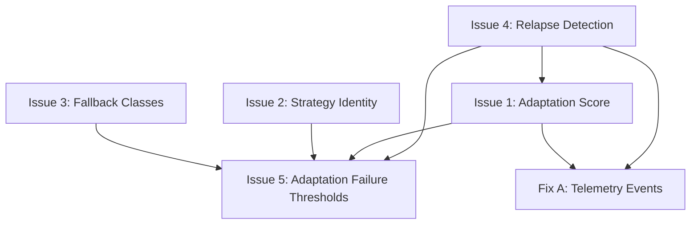

# Phase 4C Architectural Fixes — Requirements

## Overview

The Phase 4C addendum (Section 9) of [`phase-4-architecture.md`](../semantic-loop-detection/phase-4-architecture.md) covers "Intervention Effectiveness & Adaptation Monitoring." An independent review identified 5 architectural issues that undermine the correctness, determinism, and practical utility of the Phase 4C design. This spec addresses those issues plus two additional housekeeping fixes.

**Target file:** `.roo/specs/semantic-loop-detection/phase-4-architecture.md` (Section 9, lines 1173–1441)

**Priority note:** Issue #4 (Relapse Detection) is foundational — it changes the design of `InterventionOutcome`, `AdaptationScore`, `AdaptationFailureDetector`, telemetry, and success metrics. The other fixes are incremental. Relapse detection should be designed and implemented first.

---

## Issue 1: Adaptation Score is Underspecified

### Problem

The current `adaptationScore` is computed as:

```text
adaptationScore = successful interventions / total interventions
```

This treats any intervention where `progressAfter > progressBefore + recoveryThreshold` as "successful," even if the agent relapses into the same loop shortly after. A sequence like:

```text
Loop → Compression → 2 good turns → Same loop again
```

is counted as successful, which inflates the score and masks real adaptation failures.

### Requirement

- **REQ-1.1:** `InterventionOutcome` must include `recoveryTurns: number` — the count of turns after the intervention where progress remained above threshold.
- **REQ-1.2:** `InterventionOutcome` must include `relapsed: boolean` and `relapseTimestamp?: number` — indicating whether the agent returned to a similar loop after apparent recovery.
- **REQ-1.3:** An intervention is only considered "successful" if `recovered === true AND relapsed === false AND recoveryTurns >= N` (where N is a configurable minimum, default: 3).
- **REQ-1.4:** The `adaptationScore` formula must exclude relapsed interventions from the "successful" count.

---

## Issue 2: AdaptationFailureDetector Has No Deterministic Strategy Identity

### Problem

The detection algorithm states: "same strategy + same tools N times," but "same strategy" is not defined. Without a deterministic strategy fingerprint, the detector cannot reliably compare strategies across turns, violating the Phase 4 design principle that all components must be pure functions or deterministic state machines.

### Requirement

- **REQ-2.1:** `AdaptationFailureDetector` must reuse Phase 4B's existing `StrategyRecord` and `StrategyMemory` types for strategy identity, rather than inventing new comparison logic.
- **REQ-2.2:** The detector must store `lastFailedStrategyFingerprint: string` and `failedStrategyIds: string[]` to track which specific strategies have failed.
- **REQ-2.3:** Strategy comparison must use the existing `StrategyRecord.fingerprint` field, ensuring deterministic identity across turns.

---

## Issue 3: ForceFallback Is Too Tool-Centric

### Problem

The current `FALLBACK_MAPPING` maps specific tool names to specific alternative tool names:

```text
apply_diff → write_to_file
read_file → search_files
```

This is brittle — it breaks when new tools are added, when tools are renamed, or when the failure is about the approach rather than the specific tool.

### Requirement

- **REQ-3.1:** Introduce a `FallbackClass` enum with values: `Strategy`, `Tool`, `Delegation`, `Completion`.
- **REQ-3.2:** Fallback recommendations must target failed **approaches** (strategy classes), not specific tool names.
- **REQ-3.3:** The fallback hierarchy should follow a progression:
  ```text
  Read-heavy exploration → implementation
  Implementation failing → verification
  Verification failing → ask_followup_question
  Repeated dead ends → attempt_completion(blocked)
  ```
- **REQ-3.4:** `ForceFallbackRecommendation.fallbackType` must use `FallbackClass` instead of the current `"strategy" | "tool" | "provider"` string union.
- **REQ-3.5:** The existing tool-specific `FALLBACK_MAPPING` constant must be replaced or supplemented with a strategy-class-based mapping.

---

## Issue 4: Missing Relapse Detection (Foundational)

### Problem

This is the most important missing component. The current design has no mechanism to detect when an agent recovers from a loop and then falls back into the same (or similar) loop. Without relapse detection, intervention effectiveness tracking is unreliable — the system cannot distinguish "recovered permanently" from "recovered briefly then failed again."

### Requirement

- **REQ-4.1:** Add a `RelapseEvent` interface:
  ```ts
  export interface RelapseEvent {
      originalCompressionId: string
      turnsSinceRecovery: number
      similarityToOriginalLoop: number
      timestamp: number
  }
  ```
- **REQ-4.2:** Add a `RelapseDetector` module that watches for the pattern: `loop → intervention → recovery → same loop` and emits `RelapseDetected` signals.
- **REQ-4.3:** `RelapseDetector` must use the existing loop detection similarity metrics (from Phase 1-3) to determine whether a new loop is "the same" as a previously resolved one.
- **REQ-4.4:** `RelapseDetector` output must feed into `InterventionOutcome.relapsed` (Issue 1) and `AdaptationFailureDetector` (Issue 5), making it the foundation for meaningful effectiveness tracking.

---

## Issue 5: Adaptation Failure Uses Weak Thresholds

### Problem

The current adaptation failure trigger is:

```text
same failure 3 times AND adaptationScore < 0.3
```

The global `adaptationScore` can hide current failures — a historically high score can mask a recent streak of consecutive failures.

### Requirement

- **REQ-5.1:** Track `consecutiveFailedInterventions` as a dedicated counter, separate from the global `adaptationScore`.
- **REQ-5.2:** Trigger adaptation failure when `consecutiveFailedInterventions >= 3` (configurable threshold).
- **REQ-5.3:** Optionally combine with adaptation score: `consecutiveFailedInterventions >= 3 AND adaptationScore < 0.5` (note: the threshold should be raised from 0.3 to 0.5 to be more meaningful).
- **REQ-5.4:** `consecutiveFailedInterventions` must reset to 0 upon a successful, non-relapsed intervention.

---

## Additional Fix A: Telemetry Events for Relapse

### Problem

Current telemetry cannot distinguish "successful forever" from "successful briefly then failed again."

### Requirement

- **REQ-A.1:** Add `InterventionRelapsed` telemetry event to `RooCodeEventName` enum.
- **REQ-A.2:** Add `AdaptationRecovered` telemetry event to `RooCodeEventName` enum.
- **REQ-A.3:** These events must include the `originalCompressionId` and `turnsSinceRecovery` so dashboards can correlate relapses with their original interventions.

---

## Additional Fix B: Document Versioning

### Problem

The document contains two "Document version: 1.1" footers — one before Section 9 (from the original Phase 4A/4B content) and one at the end of Section 9.

### Requirement

- **REQ-B.1:** Remove the footer before Section 9 (the duplicate).
- **REQ-B.2:** Update the final footer to version 1.2:
  ```text
  Document version: 1.2
  Phase: Research and Design
  Implementation: Not started
  ```

---

## Dependencies Between Issues



Issue 4 is foundational — it must be designed first because it changes `InterventionOutcome`, `AdaptationScore`, `AdaptationFailureDetector`, telemetry, and success metrics. Issues 1, 2, 3, and 5 are incremental and can be designed after Issue 4.

---

## Non-Requirements

- **NR-1:** No implementation code changes — this spec only modifies the architecture design document.
- **NR-2:** No changes to Phase 4A or 4B sections — only Section 9 (Phase 4C) is modified.
- **NR-3:** No new runtime dependencies — all new types reuse existing Phase 4B constructs.