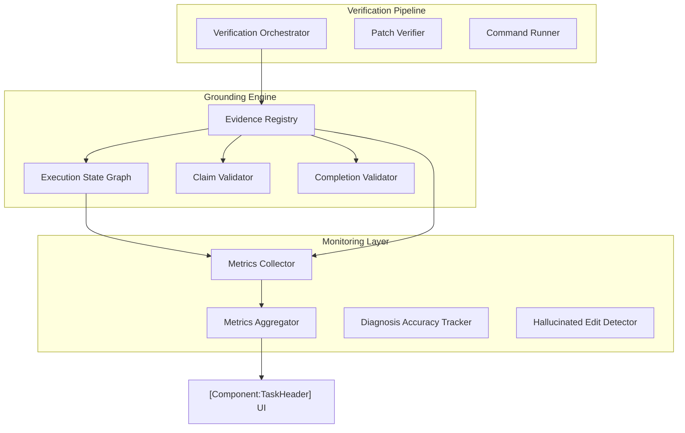

# Design Document: Agent Grounding and Metrics

## Overview

The Grounding and Metrics system provides a multi-layered verification and monitoring framework. It ensures the agent's internal state remains synchronized with external reality via deterministic transition rules and continuous automated testing.

## Architecture

### Component Diagram



### Integration Points

1.  **Task Execution Loop (`[Component:Task]`)**: Initializes state/registry; intercepts tool results to update evidence and drive state transitions.
2.  **Edit Flow (`[Component:DiffViewProvider]`)**: Triggers `VerificationOrchestrator` after file writes.
3.  **Prompt Generation (`[Component:PromptGenerator]`)**: Injects `ExecutionStateGraph` into environment details.
4.  **Condensation (`[Component:CondensePipeline]`)**: Preserves evidence summaries and unresolved contradictions.

## Data Structures

### ExecutionStateGraph
```typescript
interface ExecutionStateGraph {
  diagnosis: "not_started" | "investigating" | "hypothesis" | "confirmed"
  implementation: "not_started" | "editing" | "edited" | "verified"
  testing: "not_started" | "running" | "passed" | "failed"
  vcs: "none" | "committed" | "pushed"
}
```

### VerificationResult
```typescript
interface VerificationResult {
  passed: boolean
  checks: Array<{ checkType: string, status: string, message: string }>
  evidenceMessage: string
}
```

## Algorithms

### 1. State Transition
Maps `(currentState, toolEvent) -> newState`. Pure function. Diagnostic patterns in file reads trigger "investigating"; successful tests after edits trigger "verified".

### 2. Claim Validation
Keyword-based extraction of claims from agent text -> Evidence lookup in Registry -> Pass/Contradiction status.

### 3. Reliability Metrics
Diagnosis Accuracy = `confirmed / total`. Token Efficiency = `usefulTokens / totalTokens`. Recovery Rate = `recovered / totalFailures`.

## Performance Constraints
- **State/Evidence recording**: < 1ms per entry.
- **Claim extraction**: < 5ms per message.
- **Verification checks**: Parallelized; timeouts managed (30s/60s).
