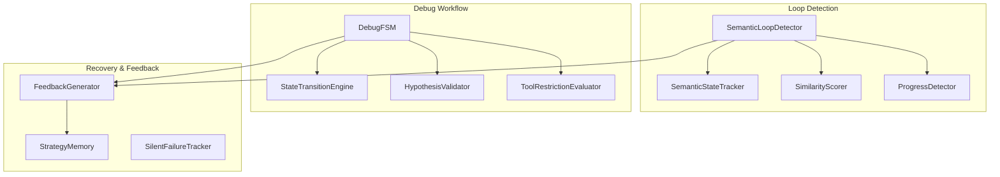

# Design Document: Reasoning Recovery

## Overview

The Reasoning Recovery system implements a multi-faceted approach to breaking agent reasoning cycles. It combines signal-based loop detection with a prescriptive debug workflow state machine to ensure agents stay focused on productive task advancement.

## Architecture

### Component Diagram



### Integration Points

1.  **Task Execution Loop (`Task.ts`)**: Hooks into `recursivelyMakeClineRequests` to capture turn data and check for loops/FSM transitions.
2.  **Tool Filtering Pipeline**: `ToolRestrictionEvaluator` injects phase-based constraints into `filterNativeToolsForMode`.
3.  **Environment Details**: `FeedbackGenerator` injects recovery hints into the user message context.
4.  **Context Management**: Triggers `manageContext` for loop-break compression.

## Data Structures

### ReasoningTurn
```typescript
interface ReasoningTurn {
    toolPattern: string[]
    filesTouched: Set<string>
    hypotheses: string[]
    conclusions: string[]
}
```

### DebugStateTracker
```typescript
interface DebugStateTracker {
    currentState: "investigate" | "hypothesize" | "validate" | "confirm" | "fix" | "verify"
    hypothesis: DebugHypothesis | null
    evidence: DebugEvidence[]
    investigateTurnCount: number
}
```

## Algorithms

### 1. Loop Confidence Calculation
Loop Confidence increases when similarity is high and progress is weak. Decreases when strong progress (file modification) occurs.

### 2. Debug FSM Transitions
Enforces a linear path. "Hypothesize" requires valid JSON. "Confirm" requires `ask_followup_question` with user response or confidence > 0.9.

### 3. Wandering Detection
Triggers when Similarity is LOW but Progress is also LOW across multiple turns (exploration without convergence).

## Performance Constraints
- **Similarity Scoring**: Synchronous, O(N) where N is window size.
- **FSM State Check**: < 1ms overhead.
- **Feedback Injection**: Capped at ~500 tokens for 3 turns post-compression.
