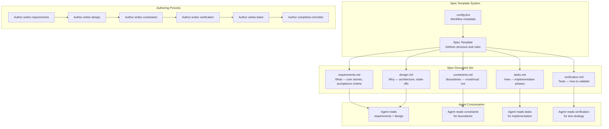

# Design Document: Spec System Redesign

## Overview

The Spec System Redesign restructures the spec template from a three-document format (requirements, design, tasks) into a four-document format (requirements, design, constraints, verification) plus tasks. The core change is the separation of intent from implementation: requirements define **what**, design explains **why**, constraints define **boundaries**, and verification defines **how to validate**. Implementation details are confined to tasks.md and expressed at the "what to implement" level.

This is a meta-spec — it defines the spec template itself, not a feature implementation. The design decisions below explain why this structure was chosen over alternatives.

## Architecture

### Component Diagram



### Section Responsibilities

#### requirements.md — What

Defines the feature's behavior and scope without specifying how it is implemented.

**Responsibilities:**
- Introduce the feature with context and motivation
- Define domain terms in a glossary
- Express requirements as user stories with numbered acceptance criteria
- Mark explicit out-of-scope items
- Summarize acceptance criteria in a table

**Does NOT contain:**
- Implementation steps
- Code-level details
- Line numbers or variable names

#### design.md — Why

Explains architectural decisions, trade-offs, and system structure.

**Responsibilities:**
- Provide an overview of the proposed design
- Show architecture via diagrams (Mermaid)
- Identify integration points with existing systems
- Define data structures (TypeScript interfaces where applicable)
- Explain algorithms with rationale, not just steps
- State performance constraints

**Does NOT contain:**
- Implementation instructions
- Step-by-step code modifications

#### constraints.md — Boundaries

Defines hard boundaries that the implementation must respect.

**Responsibilities:**
- List MUST rules (hard requirements that cannot be violated)
- List MUST NOT rules (prohibitions — things the feature must never do)
- State explicit assumptions about the environment or context

**Does NOT contain:**
- Implementation details
- User stories or acceptance criteria

#### verification.md — Tests

Defines how to verify the feature works correctly.

**Responsibilities:**
- Describe test strategy (unit, integration, end-to-end)
- List specific validation checks
- Define completion criteria (what "done" look like)

**Does NOT contain:**
- Test code or test file paths (those belong in tasks.md)

#### tasks.md — How

Defines the implementation breakdown in phased tasks.

**Responsibilities:**
- Organize implementation into phases (Foundation, Core Logic, Integration, Verification)
- Describe each task at the "what to implement" level
- Reference specific requirements for traceability
- Include checkpoints for incremental validation

**Does NOT contain:**
- Line-level instructions ("modify line 42")
- Variable-level details ("add field X as optional prop")

## Integration Points

### 1. Existing Spec Directory (`.roo/specs/`)

The new template replaces the current three-file structure in `.roo/specs/<spec-name>/`. The directory layout remains the same; only the file contents change.

**Current structure:**
```
.roo/specs/<spec-name>/
  .config.kiro
  requirements.md
  design.md
  tasks.md
```

**New structure:**
```
.roo/specs/<spec-name>/
  .config.kiro
  requirements.md
  design.md
  constraints.md      # NEW
  verification.md     # NEW
  tasks.md
```

### 2. Kiro Config System (`.config.kiro`)

The `.config.kiro` file format is unchanged. A new `specType` value `"meta"` is added for specs that define templates or processes rather than features.

**Format:**
```json
{
  "specId": "<uuid>",
  "workflowType": "requirements-first",
  "specType": "feature"
}
```

**New specType values:**
- `"feature"` — Standard feature development (default)
- `"bugfix"` — Bug fix
- `"meta"` — Meta-spec that defines templates or processes

### 3. Steering Rules (`.roo/steering/rules.md`)

The steering rules (test coverage, lint rules, Tailwind CSS) remain unchanged. The new spec template includes a verification section that aligns with these steering rules by requiring test strategy documentation.

## Data Structures

### Spec Metadata

```typescript
interface SpecConfig {
  specId: string;           // UUID v4
  workflowType: 'requirements-first' | 'design-first' | 'fast-task';
  specType: 'feature' | 'bugfix' | 'meta';
}
```

### Section Length Limits

```typescript
interface SectionLimits {
  requirements: 400;   // lines
  design: 500;         // lines
  constraints: 100;    // lines
  verification: 150;   // lines
  tasks: 300;          // lines
  total: 1450;         // lines across all sections
}
```

### Authoring Checklist

```typescript
interface AuthoringChecklist {
  allSectionsPresent: boolean;       // All 5 files exist
  acceptanceCriteriaFormatted: boolean; // SHALL/MUST/IF/THEN/WHEN used
  constraintsIncludeProhibitions: boolean; // MUST NOT rules present
  verificationIncludesTestStrategy: boolean; // Test strategy documented
  noLineLevelDetails: boolean;       // No line numbers in req/design/constraints
  sectionLengthLimitsRespected: boolean; // All sections under limit
  glossaryComplete: boolean;         // All domain terms defined
  architectureDiagramsPresent: boolean; // Mermaid diagrams in design
  configFileCreated: boolean;        // .config.kiro exists
}
```

## Algorithms

### 1. Spec Creation Flow

**Purpose:** Guide an author through creating a new spec using the template.

```
function createSpec(specName: string, specType: string):
  1. Create directory: .roo/specs/{specName}/
  2. Create .config.kiro with generated UUID
  3. Create requirements.md from template
  4. Create design.md from template
  5. Create constraints.md from template
  6. Create verification.md from template
  7. Create tasks.md from template
  8. Return spec directory path
```

### 2. Spec Validation Flow

**Purpose:** Validate that a completed spec meets the template requirements.

```
function validateSpec(specPath: string):
  1. Check all 5 files exist
  2. Check each section has required subsections
  3. Check acceptance criteria use SHALL/MUST/IF/THEN/WHEN format
  4. Check constraints section has MUST NOT rules
  5. Check verification section has test strategy
  6. Check no line-level implementation details in req/design/constraints
  7. Check section lengths are within limits
  8. Check .config.kiro has valid format
  9. Return validation result with pass/fail and list of issues
```

### 3. Spec Length Check

**Purpose:** Flag sections that exceed their length limits.

```
function checkSectionLengths(specPath: string):
  1. Count lines in each section file
  2. Compare against SectionLimits
  3. For each section exceeding limit:
     a. Flag the section
     b. Suggest splitting into sub-specs
  4. Report total spec length vs. limit
```

## Performance Constraints

- **Spec creation overhead**: The template should not add more than 2 files to the spec directory (constraints.md and verification.md are new).
- **Agent context usage**: The total spec length (1450 lines max) should fit within a single context window for most agents.
- **Template maintenance**: The template should be easy to update — changes to the template should not require changes to existing specs unless the author opts in.
- **Backward compatibility**: Existing three-file specs should continue to work — the new structure is additive, not a hard migration requirement.

## Design Trade-offs

### 1. Four sections vs. three sections

**Decision:** Add Constraints and Verification as separate sections.

**Rationale:** The current three-file structure scatters "must not" rules across requirements and buries test strategy in tasks. Separate sections make boundaries and verification first-class concerns, reducing the chance they are overlooked.

**Alternative considered:** Keep three files and add Constraints and Verification as subsections within design.md. Rejected because it does not give boundaries and verification enough prominence.

### 2. Section length limits

**Decision:** Enforce maximum line counts per section.

**Rationale:** Current specs (e.g., semantic-loop-detection at 1172 lines for design.md alone) are too long for agents to process effectively. Length limits force conciseness and splitting.

**Alternative considered:** Soft guidelines instead of hard limits. Rejected because guidelines are ignored under time pressure; hard limits with validation tooling are more effective.

### 3. Implementation detail isolation

**Decision:** Confine implementation details to tasks.md only.

**Rationale:** When requirements and design contain implementation details, agents focus on following instructions rather than understanding the problem. Separating intent from implementation preserves agent reasoning capacity.

**Alternative considered:** Allow implementation details in design.md for complex features. Rejected because it creates inconsistency — some specs would have details in design, others in tasks, making the template harder to follow.

### 4. Self-documenting template

**Decision:** The template itself demonstrates the structure with example content.

**Rationale:** Authors learn by example. A template with inline explanations and sample content reduces the need for separate documentation.

**Alternative considered:** Separate template documentation with a minimal template. Rejected because authors would need to reference two documents instead of one, increasing friction.
