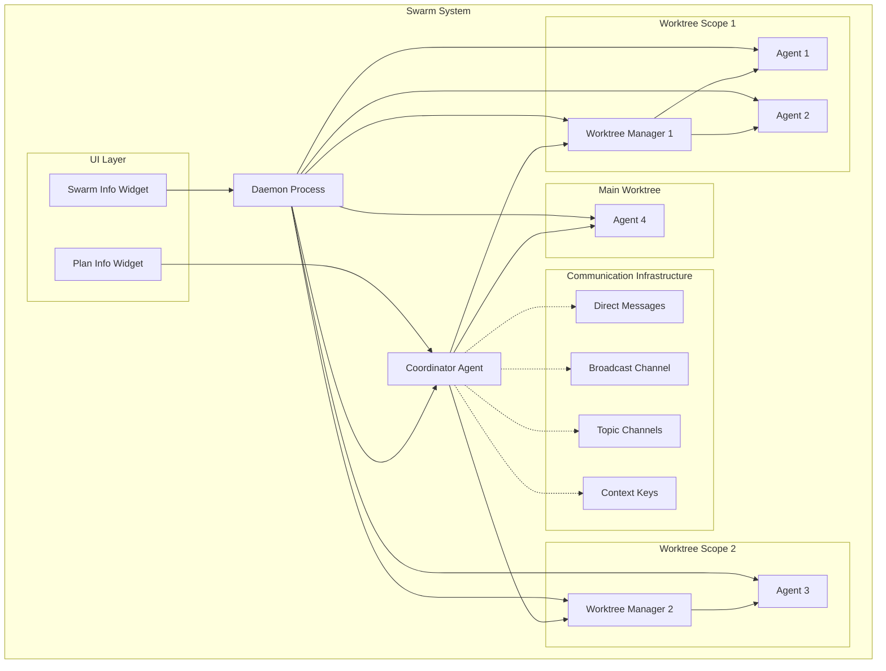
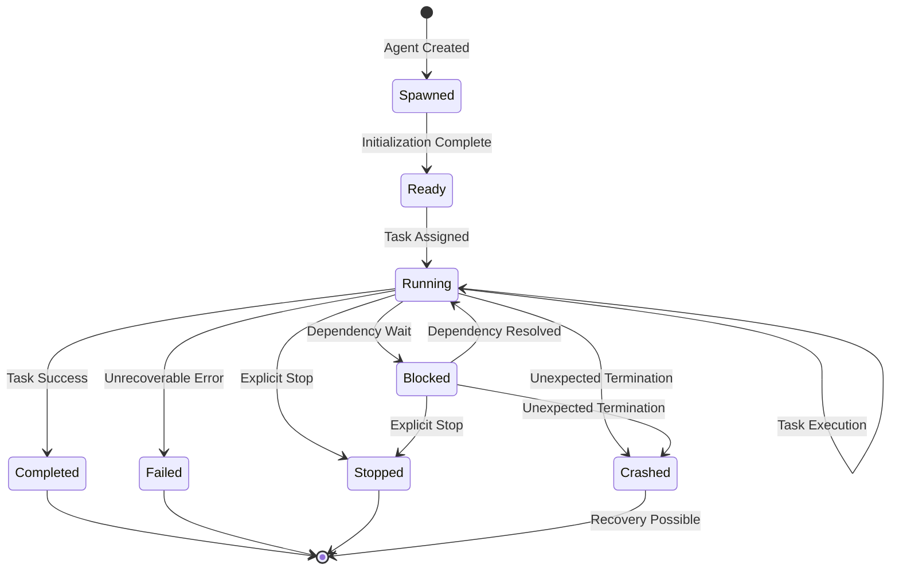

# Design Document: Swarm Architecture

## Overview

The Swarm Architecture extends the existing async_task system to enable sophisticated parallel agent coordination through explicit communication channels, optional git worktree isolation, and coordinated planning. The system transforms the current simple parallel execution model into a full multi-agent coordination framework.

### Current State

The existing async_task implementation (AsyncTaskTool, AsyncSubtaskManager) provides:
- Parallel subtask spawning (2-5 concurrent tasks)
- Git worktree isolation per subtask
- Automatic merge phase when all subtasks complete
- Basic lifecycle tracking (spawned, running, completed, failed)

### Proposed Enhancement

The Swarm Architecture adds:
- **Three-tier agent hierarchy**: Coordinator → Worktree Managers → Agents
- **Multi-channel communication**: DMs, broadcasts, topic channels, context keys
- **Soft interrupt delivery**: Non-blocking notification queuing
- **Proactive conflict detection**: Touch notifications and intent broadcasting
- **Plan evolution**: Collaborative task decomposition and dependency management
- **Crash recovery**: Daemon-based state snapshots
- **Real-time UI**: Swarm and plan visualization widgets

### Design Philosophy

1. **Optimistic Concurrency**: Agents work without locks; conflicts detected and resolved reactively
2. **Explicit Coordination**: Communication through well-defined channels rather than implicit synchronization
3. **Hierarchical Management**: Coordinator handles global concerns; Worktree Managers handle scope-local integration
4. **Graceful Degradation**: System operates with or without worktrees; recovers from crashes
5. **Observable State**: All agent states, communications, and plan changes visible in real-time


## Architecture

### System Components




### Component Responsibilities

#### Coordinator Agent

The Coordinator is the root agent that orchestrates the entire swarm:

**Responsibilities:**
- Create initial plan with task DAG, dependencies, ownership, scope, checkpoints
- Decide whether to use git worktrees for isolation
- Spawn Worktree Managers for each worktree scope
- Spawn Agents and assign them to tasks
- Track agent lifecycle states across the swarm
- Review and approve/reject plan update proposals
- Coordinate cross-worktree integration
- Distribute plan updates out-of-band (not in repository)
- Collect completion reports and maintain audit trail

**Lifecycle:**
- Created when user initiates a swarm-enabled task
- Persists for the duration of the swarm execution
- Transitions to completed when all tasks finish or failed if unrecoverable error occurs

#### Worktree Manager

A Worktree Manager owns a single git worktree scope and coordinates agents within it:

**Responsibilities:**
- Own exactly one git worktree (branch + working directory)
- Coordinate all agents assigned to its worktree scope
- Handle integration of changes within the worktree
- Detect and coordinate resolution of intra-worktree conflicts
- Communicate with Coordinator for cross-worktree coordination
- Prepare worktree for merge back to main branch

**Lifecycle:**
- Spawned by Coordinator when worktree isolation is used
- Persists until all agents in its scope complete
- Handles integration and cleanup before terminating


#### Agent

Agents are worker entities that execute tasks in parallel:

**Responsibilities:**
- Execute assigned tasks independently
- Propose plan updates when discovering new complexity or dependencies
- Communicate via DMs, broadcasts, channels, and context keys
- Declare intent before modifying files
- Respond to touch notifications for conflict detection
- Report completion with outcome, changes, validation, and blockers
- Forward final responses automatically for spawn prompts and assigned tasks

**Lifecycle:**
- Spawned by Coordinator or Worktree Manager
- Transitions: spawned → ready → running → (blocked | completed | failed | stopped | crashed)
- Can be blocked waiting for dependencies or coordination
- Reports back to spawner on completion or failure

#### Daemon Process

The Daemon is a persistent background process that manages swarm state:

**Responsibilities:**
- Maintain global swarm state (agent registry, communication queues, plan)
- Deliver soft interrupts (DMs, broadcasts, channel messages, touch notifications)
- Periodically snapshot state for crash recovery
- Provide state query API for UI widgets
- Manage communication channel subscriptions
- Track context key updates and subscriptions

**Lifecycle:**
- Started when first swarm is initiated
- Persists across multiple swarm executions
- Handles graceful shutdown and state persistence


### Communication Infrastructure

#### Direct Messages (DM)

Point-to-point communication between two specific agents:

**Characteristics:**
- Addressed by agent identifier (UUID)
- Delivered as soft interrupt to recipient
- FIFO ordering per sender-recipient pair
- Includes sender ID, timestamp, message content

**Use Cases:**
- Conflict resolution negotiation
- Dependency coordination
- Status queries between agents

#### Broadcast Channel

One-to-all communication for swarm-wide announcements:

**Characteristics:**
- Delivered to all active agents
- Soft interrupt delivery
- Includes sender ID, timestamp, message content

**Use Cases:**
- Critical state changes
- Global coordination events
- Emergency stop signals

#### Topic Channels

Many-to-many communication for group coordination:

**Characteristics:**
- Named channels (e.g., "frontend-team", "database-migration")
- Agents explicitly join/leave channels
- Messages delivered only to channel members
- Soft interrupt delivery
- Channel discovery and membership inspection

**Use Cases:**
- Feature-specific coordination
- Cross-cutting concern discussions
- Subsystem-level planning


#### Context Keys

Shared key-value storage for coordination state:

**Characteristics:**
- String keys, arbitrary JSON values
- Atomic read-modify-write operations
- Optional subscription for update notifications
- Persistent across agent lifecycle

**Use Cases:**
- Shared configuration
- Coordination flags (e.g., "migration-complete")
- Aggregated state (e.g., test pass counts)

#### Touch Notifications

File modification signals for conflict detection:

**Characteristics:**
- Automatically sent when agent modifies a file
- Includes file path, modifying agent ID, timestamp
- Delivered as soft interrupt to all other agents
- Agents compare against their working set

**Use Cases:**
- Detect concurrent modifications
- Trigger conflict resolution
- Maintain awareness of file ownership

#### Intent Broadcasting

Proactive declaration of planned file modifications:

**Characteristics:**
- Optional field on file-modifying tool calls
- Specifies file paths agent plans to modify
- Broadcast to all agents before modification
- Enables proactive conflict avoidance

**Use Cases:**
- Prevent concurrent modifications
- Coordinate file ownership
- Enable early conflict detection


## Components and Interfaces

### Agent Interface

```typescript
interface IAgent {
  // Identity
  agentId: string
  agentType: 'coordinator' | 'worktree_manager' | 'agent'
  parentId?: string
  worktreeScope?: string
  
  // Lifecycle
  state: AgentState
  spawnedAt: Date
  lastHeartbeat: Date
  
  // Communication
  sendDM(recipientId: string, message: string): Promise<void>
  broadcast(message: string): Promise<void>
  joinChannel(channelName: string): Promise<void>
  leaveChannel(channelName: string): Promise<void>
  sendToChannel(channelName: string, message: string): Promise<void>
  
  // Context
  setContextKey(key: string, value: any): Promise<void>
  getContextKey(key: string): Promise<any>
  subscribeToKey(key: string): Promise<void>
  
  // Notifications
  checkPendingNotifications(): Promise<Notification[]>
  
  // Plan
  proposePlanUpdate(update: PlanUpdate): Promise<void>
  
  // Completion
  reportCompletion(report: CompletionReport): Promise<void>
}
```

### Daemon Interface

```typescript
interface IDaemon {
  // Agent Registry
  registerAgent(agent: AgentMetadata): Promise<void>
  unregisterAgent(agentId: string): Promise<void>
  getAgent(agentId: string): Promise<AgentMetadata | null>
  listAgents(): Promise<AgentMetadata[]>
  
  // Communication
  sendDM(senderId: string, recipientId: string, message: string): Promise<void>
  broadcast(senderId: string, message: string): Promise<void>
  createChannel(name: string, creatorId: string): Promise<void>
  joinChannel(agentId: string, channelName: string): Promise<void>
  leaveChannel(agentId: string, channelName: string): Promise<void>
  sendToChannel(senderId: string, channelName: string, message: string): Promise<void>
  listChannels(): Promise<ChannelInfo[]>
  getChannelMembers(channelName: string): Promise<string[]>
  
  // Context Keys
  setContextKey(key: string, value: any, setterAgentId: string): Promise<void>
  getContextKey(key: string): Promise<any>
  listContextKeys(): Promise<string[]>
  subscribeToKey(agentId: string, key: string): Promise<void>
  
  // Notifications
  getPendingNotifications(agentId: string): Promise<Notification[]>
  
  // Touch Notifications
  notifyFileTouch(agentId: string, filePath: string): Promise<void>
  
  // Intent Broadcasting
  broadcastIntent(agentId: string, filePaths: string[]): Promise<void>
  
  // Plan Management
  setPlan(plan: Plan): Promise<void>
  getPlan(): Promise<Plan | null>
  
  // Snapshots
  createSnapshot(): Promise<void>
  restoreFromSnapshot(snapshotId: string): Promise<void>
  listSnapshots(): Promise<SnapshotMetadata[]>
}
```


### Worktree Manager Interface

```typescript
interface IWorktreeManager extends IAgent {
  // Worktree Management
  worktreePath: string
  branchName: string
  assignedAgents: string[]
  
  // Integration
  detectConflicts(): Promise<ConflictInfo[]>
  coordinateResolution(conflict: ConflictInfo): Promise<void>
  prepareForMerge(): Promise<MergePreparation>
}
```

### Coordinator Interface

```typescript
interface ICoordinator extends IAgent {
  // Plan Management
  createInitialPlan(taskDescription: string): Promise<Plan>
  reviewPlanUpdate(update: PlanUpdate): Promise<PlanUpdateDecision>
  distributePlan(plan: Plan): Promise<void>
  
  // Agent Spawning
  spawnWorktreeManager(worktreePath: string, branchName: string): Promise<string>
  spawnAgent(taskId: string, mode: string, message: string): Promise<string>
  
  // Lifecycle Management
  trackAgentState(agentId: string, state: AgentState): Promise<void>
  handleAgentCompletion(report: CompletionReport): Promise<void>
  handleAgentFailure(agentId: string, error: string): Promise<void>
  
  // Worktree Decision
  decideWorktreeUsage(plan: Plan): Promise<WorktreeDecision>
}
```


## Data Models

### Agent Lifecycle State Machine



**State Definitions:**

- **Spawned**: Agent process created, not yet initialized
- **Ready**: Agent initialized and waiting for task assignment
- **Running**: Agent actively executing assigned task
- **Blocked**: Agent waiting for dependencies or coordination
- **Completed**: Agent successfully finished assigned task
- **Failed**: Agent encountered unrecoverable error
- **Stopped**: Agent explicitly stopped by user or coordinator
- **Crashed**: Agent terminated unexpectedly, state preserved for recovery


### Plan Structure

```typescript
interface Plan {
  planId: string
  version: number
  createdAt: Date
  updatedAt: Date
  
  // Task Graph
  tasks: Task[]
  dependencies: Dependency[]
  
  // Metadata
  description: string
  estimatedDuration?: number
  
  // History
  updateHistory: PlanUpdate[]
}

interface Task {
  taskId: string
  description: string
  owner?: string  // Agent ID
  scope?: string  // Worktree scope or 'main'
  status: 'pending' | 'in_progress' | 'blocked' | 'completed' | 'failed'
  
  // Dependencies
  dependsOn: string[]  // Task IDs
  blockedBy: string[]  // Task IDs currently blocking this task
  
  // Checkpoints
  checkpoints: Checkpoint[]
  
  // Metadata
  estimatedEffort?: number
  priority?: number
  tags?: string[]
}

interface Dependency {
  fromTaskId: string
  toTaskId: string
  type: 'hard' | 'soft'  // hard = must complete before; soft = should complete before
  description?: string
}

interface Checkpoint {
  checkpointId: string
  description: string
  status: 'pending' | 'completed' | 'failed'
  completedAt?: Date
  validationResult?: string
}
```


### Communication Message Formats

```typescript
// Direct Message
interface DirectMessage {
  messageId: string
  senderId: string
  recipientId: string
  content: string
  timestamp: Date
  read: boolean
}

// Broadcast Message
interface BroadcastMessage {
  messageId: string
  senderId: string
  content: string
  timestamp: Date
  recipients: string[]  // All agent IDs at time of broadcast
}

// Channel Message
interface ChannelMessage {
  messageId: string
  channelName: string
  senderId: string
  content: string
  timestamp: Date
  recipients: string[]  // Channel members at time of message
}

// Touch Notification
interface TouchNotification {
  notificationId: string
  filePath: string
  modifyingAgentId: string
  timestamp: Date
  operation: 'create' | 'modify' | 'delete'
}

// Intent Notification
interface IntentNotification {
  notificationId: string
  declaringAgentId: string
  filePaths: string[]
  timestamp: Date
  toolName: string
}

// Context Key Update Notification
interface ContextKeyNotification {
  notificationId: string
  key: string
  oldValue: any
  newValue: any
  setterAgentId: string
  timestamp: Date
}
```


### Notification Queue

```typescript
interface Notification {
  notificationId: string
  type: 'dm' | 'broadcast' | 'channel' | 'touch' | 'intent' | 'context_key'
  recipientId: string
  payload: DirectMessage | BroadcastMessage | ChannelMessage | TouchNotification | IntentNotification | ContextKeyNotification
  timestamp: Date
  delivered: boolean
  acknowledged: boolean
}

interface NotificationQueue {
  agentId: string
  notifications: Notification[]
  
  // FIFO ordering per notification type
  getNextNotification(type?: string): Notification | null
  acknowledgeNotification(notificationId: string): void
  getPendingCount(type?: string): number
}
```

### Daemon Snapshot Format

```typescript
interface DaemonSnapshot {
  snapshotId: string
  timestamp: Date
  version: string
  
  // Agent State
  agents: AgentMetadata[]
  
  // Communication State
  notificationQueues: Map<string, NotificationQueue>
  channels: ChannelInfo[]
  contextKeys: Map<string, any>
  
  // Plan State
  plan: Plan | null
  
  // Metadata
  swarmId: string
  coordinatorId: string
}

interface AgentMetadata {
  agentId: string
  agentType: 'coordinator' | 'worktree_manager' | 'agent'
  state: AgentState
  parentId?: string
  worktreeScope?: string
  spawnedAt: Date
  lastHeartbeat: Date
  taskId?: string
  mode?: string
}
```


### Worktree Metadata

```typescript
interface WorktreeMetadata {
  worktreeId: string
  path: string
  branchName: string
  baseBranch: string
  managerId: string  // Worktree Manager agent ID
  assignedAgents: string[]
  
  // State
  status: 'active' | 'merging' | 'merged' | 'failed'
  createdAt: Date
  
  // Integration
  conflicts: ConflictInfo[]
  mergePreparation?: MergePreparation
}

interface ConflictInfo {
  conflictId: string
  filePath: string
  conflictingAgents: string[]
  detectedAt: Date
  status: 'detected' | 'negotiating' | 'resolved' | 'escalated'
  resolution?: ConflictResolution
}

interface ConflictResolution {
  strategy: 'merge' | 'rebase' | 'manual' | 'coordinator_decision'
  resolvedBy: string[]
  resolvedAt: Date
  notes?: string
}

interface MergePreparation {
  worktreeId: string
  readyForMerge: boolean
  unresolvedConflicts: string[]
  testResults?: TestResults
  validationChecks: ValidationCheck[]
}
```


### Completion Report

```typescript
interface CompletionReport {
  reportId: string
  agentId: string
  taskId: string
  timestamp: Date
  
  // Outcome
  outcome: 'success' | 'failure' | 'partial'
  
  // Changes
  changes: FileChange[]
  
  // Validation
  validationResults: ValidationResult[]
  
  // Blockers
  blockers: Blocker[]
  
  // Metadata
  duration: number
  notes?: string
}

interface FileChange {
  filePath: string
  operation: 'create' | 'modify' | 'delete'
  diff?: string
  linesAdded?: number
  linesRemoved?: number
}

interface ValidationResult {
  checkName: string
  status: 'passed' | 'failed' | 'skipped'
  message?: string
  details?: any
}

interface Blocker {
  blockerId: string
  type: 'dependency' | 'conflict' | 'resource' | 'external'
  description: string
  blockingTaskIds?: string[]
  blockingAgentIds?: string[]
}
```


### Plan Update Proposal

```typescript
interface PlanUpdate {
  updateId: string
  proposerId: string
  timestamp: Date
  version: number  // Target plan version
  
  // Changes
  changes: PlanChange[]
  
  // Justification
  reason: string
  impact: string
  
  // Review
  status: 'pending' | 'approved' | 'rejected'
  reviewedBy?: string
  reviewedAt?: Date
  reviewNotes?: string
}

interface PlanChange {
  changeType: 'add_task' | 'modify_task' | 'remove_task' | 'add_dependency' | 'remove_dependency' | 'update_scope'
  targetId: string  // Task ID or Dependency ID
  before?: any
  after?: any
  description: string
}

interface PlanUpdateDecision {
  updateId: string
  approved: boolean
  reason: string
  modifiedChanges?: PlanChange[]  // Coordinator may modify the proposal
}
```


## Key Algorithms

### Soft Interrupt Delivery and Queuing

**Purpose**: Deliver notifications to agents without blocking their execution.

**Algorithm**:

```
function deliverSoftInterrupt(notification: Notification):
  1. Determine recipient agent(s) based on notification type
  2. For each recipient:
     a. Acquire lock on recipient's notification queue
     b. Append notification to queue (FIFO per type)
     c. Release lock
     d. Increment pending notification counter
  3. Return immediately (non-blocking)

function checkPendingNotifications(agentId: string):
  1. Acquire lock on agent's notification queue
  2. Retrieve all pending notifications
  3. Mark notifications as delivered
  4. Release lock
  5. Return notifications to agent
  
function processNotifications(agent: Agent):
  1. At coordination point (e.g., before tool call):
     a. Call checkPendingNotifications(agent.id)
     b. Group notifications by type
     c. Process in priority order:
        - Touch notifications (conflict detection)
        - Intent notifications (conflict avoidance)
        - DMs (direct coordination)
        - Channel messages (group coordination)
        - Broadcasts (global updates)
        - Context key updates (state changes)
  2. Agent decides how to respond to each notification
  3. Continue execution
```

**Coordination Points** (where agents check notifications):
- Before executing any file-modifying tool
- After completing a checkpoint
- When entering blocked state
- Periodically during long-running operations (e.g., every 30 seconds)


### Touch Notification and Intent Broadcasting

**Purpose**: Enable proactive and reactive conflict detection.

**Touch Notification Algorithm**:

```
function onFileModification(agentId: string, filePath: string, operation: string):
  1. Create TouchNotification:
     - filePath
     - modifyingAgentId = agentId
     - timestamp = now()
     - operation
  
  2. Get all active agents except modifying agent
  
  3. For each other agent:
     a. Deliver touch notification as soft interrupt
  
  4. Return (non-blocking)

function handleTouchNotification(agent: Agent, notification: TouchNotification):
  1. Check if filePath is in agent's working set:
     - Working set = files agent has read, modified, or declared intent for
  
  2. If filePath in working set:
     a. Detect potential conflict
     b. Determine conflict severity:
        - High: Agent has uncommitted changes to file
        - Medium: Agent has declared intent for file
        - Low: Agent has only read file
     
     c. If severity >= Medium:
        - Send DM to modifying agent
        - Negotiate resolution strategy
        - Update local working set
     
     d. If severity == Low:
        - Log conflict for awareness
        - Continue execution
  
  3. If filePath not in working set:
     - Ignore notification
```


**Intent Broadcasting Algorithm**:

```
function declareIntent(agentId: string, toolName: string, filePaths: string[]):
  1. Create IntentNotification:
     - declaringAgentId = agentId
     - filePaths
     - timestamp = now()
     - toolName
  
  2. Broadcast intent to all other agents
  
  3. Add filePaths to agent's working set with "intent" status
  
  4. Return (non-blocking)

function handleIntentNotification(agent: Agent, notification: IntentNotification):
  1. For each filePath in notification.filePaths:
     a. Check if filePath is in agent's working set
     
     b. If filePath in working set:
        - Check agent's own intent/status for file
        - If agent also has intent or changes:
          * Send DM to declaring agent
          * Negotiate who proceeds first
          * Update coordination state
        - Else:
          * Note potential conflict
          * Continue monitoring
     
     c. If filePath not in working set:
        - Ignore (no conflict)
  
  2. Update agent's conflict awareness map
```

**Working Set Management**:

```
interface WorkingSet {
  agentId: string
  files: Map<string, FileStatus>
}

interface FileStatus {
  filePath: string
  status: 'read' | 'intent' | 'modified' | 'committed'
  timestamp: Date
  operation?: string
}
```


### Conflict Detection and Resolution Coordination

**Purpose**: Detect conflicts and coordinate resolution between agents.

**Conflict Detection Algorithm**:

```
function detectConflict(agent: Agent, filePath: string, otherAgentId: string):
  1. Determine conflict type:
     a. Read-Write: Agent read file, other agent modified it
     b. Write-Write: Both agents modified same file
     c. Intent-Intent: Both agents declared intent for same file
     d. Intent-Write: Agent has intent, other agent already modified
  
  2. Assess conflict severity:
     - Critical: Write-Write with uncommitted changes
     - High: Intent-Write or Write-Write with committed changes
     - Medium: Intent-Intent
     - Low: Read-Write
  
  3. Create ConflictInfo record
  
  4. Return conflict info

function coordinateResolution(agent: Agent, conflict: ConflictInfo):
  1. If conflict.severity == Critical or High:
     a. Send DM to conflicting agent(s)
     b. Propose resolution strategy:
        - Sequential: One agent waits for other to complete
        - Merge: Both proceed, merge changes later
        - Rebase: One agent rebases on other's changes
        - Escalate: Coordinator decides
     
     c. Wait for response (with timeout)
     
     d. If agreement reached:
        - Execute agreed strategy
        - Update conflict status to 'resolved'
     
     e. If no agreement or timeout:
        - Escalate to Worktree Manager or Coordinator
        - Transition to blocked state
  
  2. If conflict.severity == Medium:
     a. Negotiate priority via DM
     b. Lower priority agent defers
  
  3. If conflict.severity == Low:
     a. Log conflict
     b. Continue execution (optimistic)
```


**Escalation to Worktree Manager**:

```
function escalateToWorktreeManager(conflict: ConflictInfo):
  1. Send conflict info to Worktree Manager via DM
  
  2. Worktree Manager analyzes conflict:
     a. Review both agents' working sets
     b. Check task dependencies
     c. Assess impact on worktree integration
  
  3. Worktree Manager decides resolution:
     a. Assign priority to one agent
     b. Request one agent to rebase
     c. Create coordination checkpoint
     d. Escalate to Coordinator if cross-worktree
  
  4. Communicate decision to both agents
  
  5. Agents execute resolution strategy
  
  6. Update conflict status

function escalateToCoordinator(conflict: ConflictInfo):
  1. Coordinator reviews conflict in context of global plan
  
  2. Coordinator may:
     a. Modify task assignments
     b. Update plan dependencies
     c. Reassign agents to different worktrees
     d. Serialize conflicting tasks
  
  3. Distribute updated plan
  
  4. Agents adjust execution based on new plan
```


### Plan Update Proposal and Approval Flow

**Purpose**: Enable collaborative plan evolution while maintaining coordinator oversight.

**Proposal Algorithm**:

```
function proposePlanUpdate(agent: Agent, changes: PlanChange[], reason: string):
  1. Create PlanUpdate:
     - updateId = generateUUID()
     - proposerId = agent.id
     - timestamp = now()
     - version = currentPlan.version
     - changes
     - reason
     - impact = assessImpact(changes)
     - status = 'pending'
  
  2. Send proposal to Coordinator via DM
  
  3. Optionally transition to blocked state if changes affect current task
  
  4. Wait for approval/rejection (non-blocking via notification)

function assessImpact(changes: PlanChange[]): string
  1. Analyze changes:
     - Count affected tasks
     - Identify affected agents
     - Estimate timeline impact
     - Check for dependency cycles
  
  2. Generate impact summary:
     - "Adds 3 tasks, affects 2 agents, +2 days estimated"
  
  3. Return impact string
```


**Approval Algorithm**:

```
function reviewPlanUpdate(coordinator: Coordinator, update: PlanUpdate):
  1. Validate update:
     a. Check version matches current plan
     b. Verify proposer is active agent
     c. Validate changes are well-formed
  
  2. Analyze impact:
     a. Check for dependency cycles
     b. Assess resource implications
     c. Verify scope assignments are valid
     d. Check for conflicts with other pending updates
  
  3. Make decision:
     a. If valid and beneficial:
        - Approve update
        - Optionally modify changes
     
     b. If invalid or harmful:
        - Reject update
        - Provide reason
     
     c. If uncertain:
        - Request clarification from proposer
        - Consult with affected agents
  
  4. Create PlanUpdateDecision
  
  5. If approved:
     a. Apply changes to plan
     b. Increment plan version
     c. Add to update history
     d. Distribute updated plan to all agents
  
  6. Send decision to proposer via DM
  
  7. If proposer was blocked, notify to resume

function distributePlan(coordinator: Coordinator, plan: Plan):
  1. Serialize plan to JSON
  
  2. Store plan in daemon (not in repository)
  
  3. Broadcast plan update notification to all agents
  
  4. Agents retrieve updated plan from daemon
  
  5. Agents adjust execution based on new plan
```


### Daemon Snapshot and Crash Recovery

**Purpose**: Enable swarm state recovery after agent crashes or system failures.

**Snapshot Creation Algorithm**:

```
function createSnapshot(daemon: Daemon):
  1. Acquire global state lock
  
  2. Collect current state:
     a. Agent registry (all agents with metadata)
     b. Notification queues (all pending notifications)
     c. Channel subscriptions and message history
     d. Context keys and values
     e. Current plan and version
     f. Worktree metadata
  
  3. Create DaemonSnapshot:
     - snapshotId = generateUUID()
     - timestamp = now()
     - version = daemon.version
     - agents = agentRegistry.getAll()
     - notificationQueues = deepCopy(queues)
     - channels = channelRegistry.getAll()
     - contextKeys = contextStore.getAll()
     - plan = currentPlan
     - swarmId = currentSwarmId
     - coordinatorId = coordinatorAgentId
  
  4. Serialize snapshot to JSON
  
  5. Write to persistent storage:
     - Primary: ~/.kiro/swarm/snapshots/{swarmId}/{snapshotId}.json
     - Backup: Keep last 10 snapshots
  
  6. Release global state lock
  
  7. Schedule next snapshot (default: every 30 seconds)

function schedulePeriodicSnapshots(daemon: Daemon):
  1. Set interval timer (default: 30 seconds)
  
  2. On each interval:
     a. Check if swarm is active
     b. If active, call createSnapshot()
     c. Prune old snapshots (keep last 10)
  
  3. On swarm completion:
     a. Create final snapshot
     b. Mark swarm as completed in metadata
```

**Crash Recovery Algorithm**:

```
function detectCrash(daemon: Daemon, agentId: string):
  1. Check agent heartbeat:
     - If lastHeartbeat > threshold (default: 60 seconds)
     - Mark agent as potentially crashed
  
  2. Attempt to ping agent process
  
  3. If no response:
     a. Update agent state to 'crashed'
     b. Create snapshot capturing crashed state
     c. Notify Coordinator of crash
  
  4. Return crash detection result

function recoverFromCrash(daemon: Daemon, snapshotId: string):
  1. Load snapshot from storage
  
  2. Validate snapshot:
     a. Check version compatibility
     b. Verify data integrity
     c. Confirm swarmId matches
  
  3. Restore state:
     a. Recreate agent registry
     b. Restore notification queues
     c. Restore channel subscriptions
     d. Restore context keys
     e. Restore plan
  
  4. Identify crashed agents:
     - Agents with state = 'crashed'
  
  5. For each crashed agent:
     a. Determine recovery strategy:
        - Restart: Spawn new agent with same task
        - Skip: Mark task as failed, continue
        - Manual: Wait for user intervention
     
     b. If restart:
        - Spawn new agent
        - Restore task context from snapshot
        - Resume from last checkpoint
     
     c. If skip:
        - Update plan to mark task as failed
        - Notify dependent tasks
     
     d. If manual:
        - Notify user via UI
        - Wait for user decision
  
  6. Resume swarm execution
  
  7. Create new snapshot after recovery

function resumeFromCheckpoint(agent: Agent, checkpoint: Checkpoint):
  1. Load checkpoint state:
     - Task progress
     - Working set
     - Intermediate results
  
  2. Restore agent context:
     - Files read/modified
     - Communication history
     - Coordination state
  
  3. Validate checkpoint:
     - Verify files still exist
     - Check for external changes
     - Confirm dependencies still valid
  
  4. Resume execution from checkpoint
  
  5. Report recovery to Coordinator
```


### Worktree Management and Integration

**Purpose**: Manage git worktree lifecycle and coordinate integration of parallel work.

**Worktree Creation Algorithm**:

```
function createWorktree(coordinator: Coordinator, taskScope: string):
  1. Generate worktree metadata:
     - worktreeId = generateUUID()
     - branchName = `swarm/${swarmId}/${taskScope}`
     - path = `{repoRoot}/.kiro/worktrees/{worktreeId}`
  
  2. Execute git worktree add:
     - git worktree add -b {branchName} {path} {baseBranch}
  
  3. Verify worktree creation:
     - Check path exists
     - Verify branch created
     - Confirm git status clean
  
  4. Create WorktreeMetadata:
     - worktreeId
     - path
     - branchName
     - baseBranch = current branch
     - status = 'active'
     - createdAt = now()
  
  5. Spawn Worktree Manager:
     - managerId = spawnWorktreeManager(worktreeId, path, branchName)
     - Update metadata with managerId
  
  6. Register worktree in daemon
  
  7. Return worktreeId

function decideWorktreeUsage(coordinator: Coordinator, plan: Plan):
  1. Analyze plan characteristics:
     a. Count parallel tasks
     b. Identify file overlap between tasks
     c. Assess conflict risk
  
  2. Apply decision heuristics:
     - If tasks < 3: No worktrees (simple parallel)
     - If file overlap > 50%: No worktrees (high merge cost)
     - If conflict risk > threshold: Use worktrees
     - If tasks have clear scope separation: Use worktrees
  
  3. Create WorktreeDecision:
     - useWorktrees: boolean
     - reason: string
     - worktreeScopes: string[] (if using worktrees)
  
  4. Return decision

interface WorktreeDecision {
  useWorktrees: boolean
  reason: string
  worktreeScopes?: string[]  // e.g., ['frontend', 'backend', 'database']
}
```

**Worktree Integration Algorithm**:

```
function prepareForMerge(worktreeManager: WorktreeManager):
  1. Verify all assigned agents completed:
     - Check agent states
     - Confirm no agents in 'running' or 'blocked' state
  
  2. Run validation checks:
     a. Execute tests in worktree
     b. Run linters
     c. Check for uncommitted changes
     d. Verify build succeeds
  
  3. Detect conflicts with base branch:
     a. Fetch latest base branch
     b. Attempt merge dry-run
     c. Identify conflicting files
  
  4. Create MergePreparation:
     - worktreeId
     - readyForMerge = (conflicts.length == 0 && validationPassed)
     - unresolvedConflicts = conflictingFiles
     - testResults
     - validationChecks
  
  5. If not ready:
     a. Notify Coordinator
     b. Request conflict resolution
     c. Wait for resolution
  
  6. If ready:
     a. Notify Coordinator
     b. Wait for merge approval
  
  7. Return MergePreparation

function mergeWorktree(coordinator: Coordinator, worktreeId: string):
  1. Get worktree metadata
  
  2. Verify merge preparation complete
  
  3. Switch to base branch
  
  4. Execute merge:
     - git merge --no-ff {branchName}
  
  5. If merge conflicts:
     a. Abort merge
     b. Escalate to Worktree Manager
     c. Request manual resolution
  
  6. If merge succeeds:
     a. Run validation in merged state
     b. If validation fails:
        - Revert merge
        - Escalate to Worktree Manager
     c. If validation passes:
        - Commit merge
        - Update worktree status to 'merged'
  
  7. Cleanup worktree:
     - git worktree remove {path}
     - Delete worktree directory
     - Update metadata
  
  8. Notify all agents of merge completion

function coordinateCrossWorktreeMerge(coordinator: Coordinator):
  1. Get all worktrees with status 'merging'
  
  2. Determine merge order:
     a. Analyze inter-worktree dependencies
     b. Create merge DAG
     c. Topological sort for merge order
  
  3. For each worktree in order:
     a. Wait for merge preparation
     b. Execute merge
     c. Validate merged state
     d. Continue to next worktree
  
  4. After all merges:
     a. Run full integration tests
     b. Validate complete system
     c. Report final status
```


### UI Widget Event Streaming

**Purpose**: Provide real-time updates to UI widgets for swarm and plan visualization.

**Event Streaming Architecture**:

```typescript
interface UIEventStream {
  // Event Types
  eventType: 'agent_state_change' | 'plan_update' | 'channel_activity' | 
             'notification_sent' | 'conflict_detected' | 'task_progress'
  
  // Event Data
  timestamp: Date
  payload: any
  
  // Routing
  widgetTargets: ('swarm_info' | 'plan_info')[]
}

// Daemon exposes WebSocket endpoint for UI widgets
interface DaemonUIAPI {
  // WebSocket connection
  connectWidget(widgetType: 'swarm_info' | 'plan_info'): WebSocket
  
  // Event subscription
  subscribeToEvents(widgetId: string, eventTypes: string[]): void
  
  // State queries
  getSwarmState(): SwarmState
  getPlanState(): PlanState
  getAgentDetails(agentId: string): AgentDetails
  getTaskDetails(taskId: string): TaskDetails
}
```

**Event Publishing Algorithm**:

```
function publishUIEvent(daemon: Daemon, event: UIEventStream):
  1. Determine target widgets:
     - Based on event type
     - Based on widget subscriptions
  
  2. For each connected widget:
     a. Check if widget subscribed to event type
     b. If subscribed:
        - Serialize event to JSON
        - Send via WebSocket
        - Track delivery status
  
  3. If no widgets connected:
     - Buffer event (keep last 100 events)
     - Deliver on next widget connection
  
  4. Log event for debugging

function handleAgentStateChange(daemon: Daemon, agentId: string, newState: AgentState):
  1. Update agent registry
  
  2. Create UIEventStream:
     - eventType = 'agent_state_change'
     - payload = { agentId, oldState, newState, timestamp }
     - widgetTargets = ['swarm_info']
  
  3. Publish event to UI widgets
  
  4. If state is 'crashed' or 'failed':
     - Create alert event
     - Highlight in UI

function handlePlanUpdate(daemon: Daemon, plan: Plan):
  1. Update plan storage
  
  2. Create UIEventStream:
     - eventType = 'plan_update'
     - payload = { planId, version, changes, timestamp }
     - widgetTargets = ['plan_info']
  
  3. Publish event to UI widgets
  
  4. Trigger plan graph re-render
```

**Swarm Info Widget Data Model**:

```typescript
interface SwarmState {
  swarmId: string
  coordinatorId: string
  
  // Agent Graph
  agents: AgentNode[]
  relationships: AgentRelationship[]
  
  // Communication
  channels: ChannelInfo[]
  recentMessages: Message[]
  
  // Status
  overallStatus: 'initializing' | 'running' | 'completing' | 'completed' | 'failed'
  startTime: Date
  activeAgents: number
  completedTasks: number
  totalTasks: number
}

interface AgentNode {
  agentId: string
  agentType: 'coordinator' | 'worktree_manager' | 'agent'
  state: AgentState
  taskId?: string
  worktreeScope?: string
  
  // Visual
  position?: { x: number, y: number }
  color: string  // Based on state
}

interface AgentRelationship {
  parentId: string
  childId: string
  type: 'spawned' | 'manages' | 'coordinates_with'
}
```

**Plan Info Widget Data Model**:

```typescript
interface PlanState {
  planId: string
  version: number
  
  // Task Graph
  tasks: TaskNode[]
  dependencies: DependencyEdge[]
  
  // Analysis
  criticalPath: string[]  // Task IDs
  blockedTasks: string[]
  
  // Progress
  completionPercentage: number
  estimatedTimeRemaining?: number
}

interface TaskNode {
  taskId: string
  description: string
  status: 'pending' | 'in_progress' | 'blocked' | 'completed' | 'failed'
  owner?: string
  scope?: string
  
  // Visual
  position?: { x: number, y: number }
  color: string  // Based on status
  isCriticalPath: boolean
}

interface DependencyEdge {
  fromTaskId: string
  toTaskId: string
  type: 'hard' | 'soft'
}
```


## Error Handling

### Error Categories

**1. Agent Lifecycle Errors**

- **Agent Spawn Failure**: Unable to create agent process
  - Recovery: Retry spawn with exponential backoff (max 3 attempts)
  - Fallback: Mark task as failed, notify Coordinator
  
- **Agent Crash**: Agent process terminates unexpectedly
  - Recovery: Detect via heartbeat, create snapshot, attempt restart from checkpoint
  - Fallback: Mark task as failed, redistribute to new agent
  
- **Agent Timeout**: Agent exceeds maximum execution time
  - Recovery: Send stop signal, wait for graceful shutdown
  - Fallback: Force terminate, mark as crashed

**2. Communication Errors**

- **Message Delivery Failure**: Unable to deliver notification
  - Recovery: Retry delivery with exponential backoff (max 5 attempts)
  - Fallback: Log failure, notify sender of delivery failure
  
- **Channel Not Found**: Agent attempts to join non-existent channel
  - Recovery: Auto-create channel if agent has permission
  - Fallback: Return error to agent
  
- **Daemon Unavailable**: Daemon process not responding
  - Recovery: Attempt daemon restart, restore from snapshot
  - Fallback: Fail entire swarm, preserve state for manual recovery

**3. Coordination Errors**

- **Conflict Resolution Timeout**: Agents unable to resolve conflict
  - Recovery: Escalate to Worktree Manager or Coordinator
  - Fallback: Serialize conflicting tasks, execute sequentially
  
- **Deadlock Detection**: Circular dependency in agent coordination
  - Recovery: Detect cycle, break lowest priority dependency
  - Fallback: Escalate to Coordinator for manual resolution
  
- **Plan Update Conflict**: Multiple agents propose conflicting updates
  - Recovery: Coordinator reviews in order, rejects conflicting updates
  - Fallback: Request agents to rebase proposals on latest plan

**4. Worktree Errors**

- **Worktree Creation Failure**: Unable to create git worktree
  - Recovery: Retry with different path, check disk space
  - Fallback: Execute tasks in main worktree without isolation
  
- **Merge Conflict**: Unable to merge worktree back to main
  - Recovery: Notify Worktree Manager, request manual resolution
  - Fallback: Preserve worktree, mark for manual merge
  
- **Worktree Corruption**: Worktree git state invalid
  - Recovery: Attempt git fsck and repair
  - Fallback: Discard worktree, restart tasks in new worktree

**5. Snapshot and Recovery Errors**

- **Snapshot Write Failure**: Unable to persist snapshot
  - Recovery: Retry write to alternate location
  - Fallback: Continue without snapshot, log warning
  
- **Snapshot Corruption**: Snapshot file unreadable or invalid
  - Recovery: Attempt to load previous snapshot
  - Fallback: Start fresh swarm, lose crashed agent state
  
- **Recovery Failure**: Unable to restore from snapshot
  - Recovery: Attempt partial recovery (restore what's valid)
  - Fallback: Manual intervention required, preserve snapshot for debugging

### Error Handling Patterns

**Graceful Degradation**:

```
function handleError(error: Error, context: ErrorContext):
  1. Classify error by category and severity
  
  2. Attempt recovery based on error type:
     - Transient errors: Retry with backoff
     - Resource errors: Wait and retry
     - Logic errors: Escalate to coordinator
     - Fatal errors: Fail fast with state preservation
  
  3. If recovery succeeds:
     - Log recovery action
     - Continue execution
     - Update metrics
  
  4. If recovery fails:
     - Execute fallback strategy
     - Notify affected agents
     - Update plan if necessary
  
  5. If fallback fails:
     - Preserve state (snapshot)
     - Notify user
     - Request manual intervention
```

**Circuit Breaker Pattern** (for daemon communication):

```
class DaemonCircuitBreaker {
  state: 'closed' | 'open' | 'half_open'
  failureCount: number
  lastFailureTime: Date
  threshold: number = 5
  timeout: number = 60000  // 60 seconds
  
  async call(operation: () => Promise<any>): Promise<any> {
    if (this.state === 'open') {
      if (Date.now() - this.lastFailureTime.getTime() > this.timeout) {
        this.state = 'half_open'
      } else {
        throw new Error('Circuit breaker open')
      }
    }
    
    try {
      const result = await operation()
      if (this.state === 'half_open') {
        this.state = 'closed'
        this.failureCount = 0
      }
      return result
    } catch (error) {
      this.failureCount++
      this.lastFailureTime = new Date()
      
      if (this.failureCount >= this.threshold) {
        this.state = 'open'
      }
      
      throw error
    }
  }
}
```


## Testing Strategy

### Unit Testing

**Component-Level Tests**:

1. **Agent Lifecycle State Machine**
   - Test all state transitions
   - Verify invalid transitions are rejected
   - Test state persistence and recovery

2. **Communication Primitives**
   - Test DM delivery and queuing
   - Test broadcast fanout
   - Test channel subscription and message routing
   - Test context key atomic operations

3. **Notification Queue**
   - Test FIFO ordering per type
   - Test queue overflow handling
   - Test concurrent access

4. **Plan Update Logic**
   - Test proposal validation
   - Test conflict detection
   - Test version management

5. **Conflict Detection**
   - Test touch notification generation
   - Test intent broadcasting
   - Test working set management
   - Test conflict severity assessment

**Mock-Based Tests**:

- Mock daemon for agent communication tests
- Mock git operations for worktree tests
- Mock file system for touch notification tests

### Integration Testing

**Multi-Agent Scenarios**:

1. **Simple Parallel Execution**
   - Spawn 3 agents with independent tasks
   - Verify all complete successfully
   - Verify no conflicts detected

2. **Conflict Detection and Resolution**
   - Spawn 2 agents modifying same file
   - Verify touch notifications delivered
   - Verify agents coordinate resolution

3. **Plan Update Flow**
   - Agent proposes plan update
   - Coordinator reviews and approves
   - All agents receive updated plan

4. **Worktree Isolation**
   - Create 2 worktrees with separate agents
   - Verify isolation (no cross-worktree conflicts)
   - Verify successful merge back to main

5. **Crash Recovery**
   - Simulate agent crash mid-execution
   - Verify snapshot captured crashed state
   - Verify recovery from snapshot

**Communication Tests**:

1. **DM Delivery**
   - Agent A sends DM to Agent B
   - Verify B receives message
   - Verify FIFO ordering

2. **Broadcast Fanout**
   - Agent broadcasts to 5 agents
   - Verify all receive message
   - Verify timing and ordering

3. **Channel Coordination**
   - 3 agents join channel
   - Verify messages delivered to all members
   - Verify non-members don't receive messages

### End-to-End Testing

**Complete Swarm Workflows**:

1. **Feature Development Swarm**
   - Coordinator creates plan with 5 tasks
   - Spawns 3 agents across 2 worktrees
   - Agents coordinate via channels
   - Worktrees merge successfully
   - All tasks complete

2. **Conflict-Heavy Scenario**
   - Multiple agents working on overlapping files
   - Verify conflict detection
   - Verify resolution coordination
   - Verify final state is consistent

3. **Crash and Recovery**
   - Start swarm with 4 agents
   - Crash 2 agents mid-execution
   - Verify recovery from snapshot
   - Verify swarm completes successfully

4. **Plan Evolution**
   - Start with simple plan
   - Agents discover additional complexity
   - Multiple plan updates proposed and approved
   - Final plan significantly different from initial
   - All tasks complete successfully

### UI Widget Testing

**Real-Time Update Tests**:

1. **Swarm Info Widget**
   - Connect widget to daemon
   - Spawn agents and verify graph updates
   - Change agent states and verify visual updates
   - Verify channel activity displayed

2. **Plan Info Widget**
   - Connect widget to daemon
   - Create plan and verify graph rendered
   - Update plan and verify graph updates
   - Verify critical path highlighted

**Event Streaming Tests**:

- Test WebSocket connection stability
- Test event buffering when widget disconnected
- Test event delivery ordering
- Test widget reconnection and state sync

### Performance Testing

**Scalability Tests**:

1. **Agent Scaling**
   - Test with 10, 20, 50 concurrent agents
   - Measure daemon throughput
   - Measure notification delivery latency

2. **Communication Scaling**
   - Test with high message volume
   - Measure queue performance
   - Measure broadcast fanout time

3. **Snapshot Performance**
   - Measure snapshot creation time
   - Measure snapshot size growth
   - Measure recovery time

**Load Tests**:

- Sustained swarm execution (1 hour+)
- High conflict rate scenarios
- Rapid plan update scenarios
- Memory leak detection

### Property-Based Testing

This feature is **NOT suitable for property-based testing** because:

1. **Infrastructure and Coordination**: The swarm architecture is primarily about process coordination, inter-process communication, and state management — not pure functions with clear input/output behavior

2. **Side-Effect Heavy**: Most operations involve side effects (spawning processes, file I/O, network communication, git operations)

3. **Stateful System**: The system maintains complex distributed state across multiple processes, making it difficult to generate arbitrary valid states

4. **External Dependencies**: Heavy reliance on git, file system, process management, and WebSocket connections

**Alternative Testing Strategies**:

- **Mock-based unit tests** for individual components
- **Integration tests** with controlled multi-agent scenarios
- **Snapshot tests** for daemon state serialization
- **End-to-end tests** for complete workflows
- **Chaos engineering** for crash recovery validation

