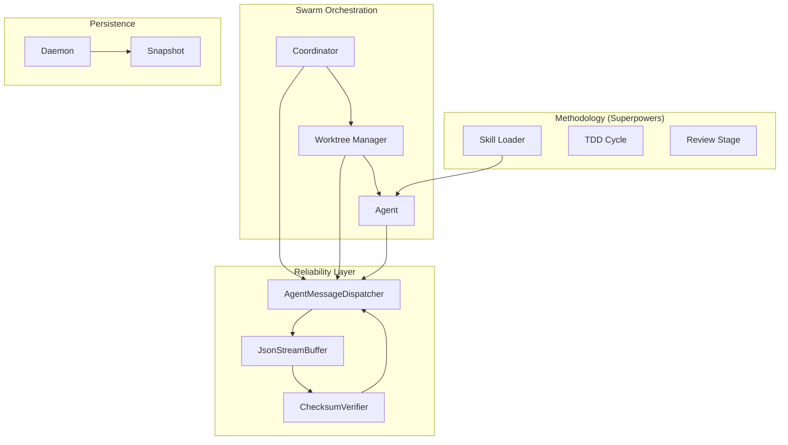

# Design Document: Swarm Coordination Framework

## Overview

The Swarm Coordination Framework implements a hierarchical agent system with a robust communication protocol and systematic development workflows. It leverages the JSON-First Communication Protocol for reliability and Superpowers Skills for methodology enforcement.

## Architecture

### Component Diagram



### Integration Points

1.  **Communication Harness**: `JsonStreamBuffer` and `ChecksumVerifier` wrap LLM API streams before dispatching to agents.
2.  **Swarm Infrastructure**: `SpawnManager`, `ChannelManager`, and `PlanManager` manage lifecycle and routing.
3.  **Superpowers Integration**: Skills are loaded into agent contexts at spawn time; `MergeManager` uses methodology patterns during branch integration.
4.  **UI Widgets**: Real-time state updates are streamed from the Daemon to Swarm and Plan info widgets.

## Data Structures

### AgentMessage
```typescript
interface AgentMessage {
  protocol: string; // "roo-agent/v1"
  id: string;
  sender: string;
  recipient: string;
  payload: AgentMessagePayload;
  checksum: string; // SHA-256 of canonical payload
}
```

### Plan
```typescript
interface Plan {
  planId: string;
  version: number;
  tasks: Task[];
  dependencies: Dependency[];
}
```

## Algorithms

### 1. Reliable Message Dispatch
LLM Stream -> `JsonStreamBuffer` (accumulate) -> `ChecksumVerifier` (SHA-256) -> `AgentMessageDispatcher` (route via `ChannelManager`).

### 2. TDD Cycle Enforcement
RED (write failing test) -> GREEN (implement code) -> REFACTOR (optimize) -> Commit.

### 3. Conflict Detection
Proactive (Intent Broadcasting) and Reactive (Touch Notifications).

## Performance Constraints
- **Checksum Computation**: < 5ms for 1MB payload.
- **Buffer Size**: Capped at 10MB per active stream.
- **Latency**: Total protocol overhead < 20ms.
