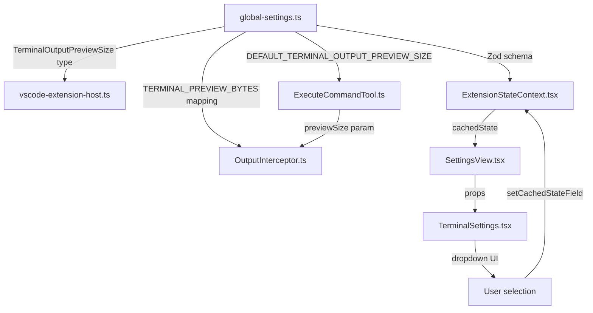

# Design: Terminal Output 50KB Default

## Architecture

The terminal output preview size system has three layers:

1. **Type/Schema layer** (`packages/types/src/global-settings.ts`) — defines the type, byte mapping, default, and Zod schema
2. **Backend layer** (`src/core/tools/ExecuteCommandTool.ts`, `src/integrations/terminal/OutputInterceptor.ts`) — uses the setting to control how much output the LLM sees
3. **UI layer** (`webview-ui/src/components/settings/TerminalSettings.tsx`, `SettingsView.tsx`, `ExtensionStateContext.tsx`) — renders the dropdown and manages state



## Changes

### 1. Type & Schema Layer — [`global-settings.ts`](packages/types/src/global-settings.ts)

**`TerminalOutputPreviewSize` type** (line 39):
```diff
- export type TerminalOutputPreviewSize = "small" | "medium" | "large"
+ export type TerminalOutputPreviewSize = "small" | "medium" | "large" | "xlarge"
```

**`TERMINAL_PREVIEW_BYTES` mapping** (line 48):
```diff
  export const TERMINAL_PREVIEW_BYTES: Record<TerminalOutputPreviewSize, number> = {
  	small: 5 * 1024, // 5KB
  	medium: 10 * 1024, // 10KB
  	large: 20 * 1024, // 20KB
+ 	xlarge: 50 * 1024, // 50KB
  }
```

**`DEFAULT_TERMINAL_OUTPUT_PREVIEW_SIZE`** (line 59):
```diff
- export const DEFAULT_TERMINAL_OUTPUT_PREVIEW_SIZE: TerminalOutputPreviewSize = "medium"
+ export const DEFAULT_TERMINAL_OUTPUT_PREVIEW_SIZE: TerminalOutputPreviewSize = "xlarge"
```

**Zod schema** (line 169):
```diff
- terminalOutputPreviewSize: z.enum(["small", "medium", "large"]).optional(),
+ terminalOutputPreviewSize: z.enum(["small", "medium", "large", "xlarge"]).optional(),
```

**Doc comments** (lines 32-35): Update the size tier descriptions to include xlarge:
```diff
  * - `small`: 5KB preview - Best for long-running commands with verbose output
  * - `medium`: 10KB preview - Balanced default for most use cases
  * - `large`: 20KB preview - Best when commands produce critical info early
+ * - `xlarge`: 50KB preview - Maximum immediate context for detailed output
```

### 2. Extension Host Type — [`vscode-extension-host.ts`](packages/types/src/vscode-extension-host.ts:255)

No change needed. Line 255 already uses `terminalOutputPreviewSize` as a string key in a union type — it does not constrain the valid values.

### 3. UI State Layer — [`ExtensionStateContext.tsx`](webview-ui/src/context/ExtensionStateContext.tsx:82)

**Interface type** (lines 82-83):
```diff
- terminalOutputPreviewSize?: "small" | "medium" | "large"
- setTerminalOutputPreviewSize: (value: "small" | "medium" | "large") => void
+ terminalOutputPreviewSize?: TerminalOutputPreviewSize
+ setTerminalOutputPreviewSize: (value: TerminalOutputPreviewSize) => void
```

This imports `TerminalOutputPreviewSize` from `@roo-code/types` instead of hardcoding the union, making it automatically follow the type definition.

### 4. Settings View — [`SettingsView.tsx`](webview-ui/src/components/settings/SettingsView.tsx:386)

**Fallback default** (line 386):
```diff
- terminalOutputPreviewSize: terminalOutputPreviewSize ?? "medium",
+ terminalOutputPreviewSize: terminalOutputPreviewSize ?? "xlarge",
```

### 5. Terminal Settings Component — [`TerminalSettings.tsx`](webview-ui/src/components/settings/TerminalSettings.tsx)

**Dropdown fallback** (line 104):
```diff
- value={terminalOutputPreviewSize || "medium"}
+ value={terminalOutputPreviewSize || "xlarge"}
```

**Add xlarge SelectItem** (after line 120):
```diff
  <SelectItem value="large">
  	{t("settings:terminal.outputPreviewSize.options.large")}
  </SelectItem>
+ <SelectItem value="xlarge">
+ 	{t("settings:terminal.outputPreviewSize.options.xlarge")}
+ </SelectItem>
```

### 6. Locale Files — All 18 `settings.json` files

Each locale file under `webview-ui/src/i18n/locales/<lang>/settings.json` needs an `xlarge` option added inside `terminal.outputPreviewSize.options`:

**English** (`en/settings.json`, line 752):
```json
"xlarge": "Extra Large (50KB)"
```

All other locales need the equivalent translation of "Extra Large" with "(50KB)" appended. The full list of locales: `ca`, `de`, `es`, `fr`, `hi`, `id`, `it`, `ja`, `ko`, `nl`, `pl`, `pt-BR`, `ru`, `tr`, `vi`, `zh-CN`, `zh-TW`.

### 7. Backend — [`ExecuteCommandTool.ts`](src/core/tools/ExecuteCommandTool.ts:213)

No change needed. This file already uses `DEFAULT_TERMINAL_OUTPUT_PREVIEW_SIZE` from the types package, so changing the constant value propagates automatically.

### 8. Backend — [`OutputInterceptor.ts`](src/integrations/terminal/OutputInterceptor.ts)

No change needed. It receives `previewSize` as a parameter and uses `TERMINAL_PREVIEW_BYTES[previewSize]` to determine the byte threshold, so the new mapping entry propagates automatically.

## Backward Compatibility

- The Zod schema uses `.optional()`, so existing users with no explicit setting will get the new `xlarge` default via the `?? DEFAULT_TERMINAL_OUTPUT_PREVIEW_SIZE` fallback
- Users who explicitly set `small`, `medium`, or `large` will keep their preference since it's stored in global state
- No data migration is needed — the setting is optional and the fallback constant handles the default