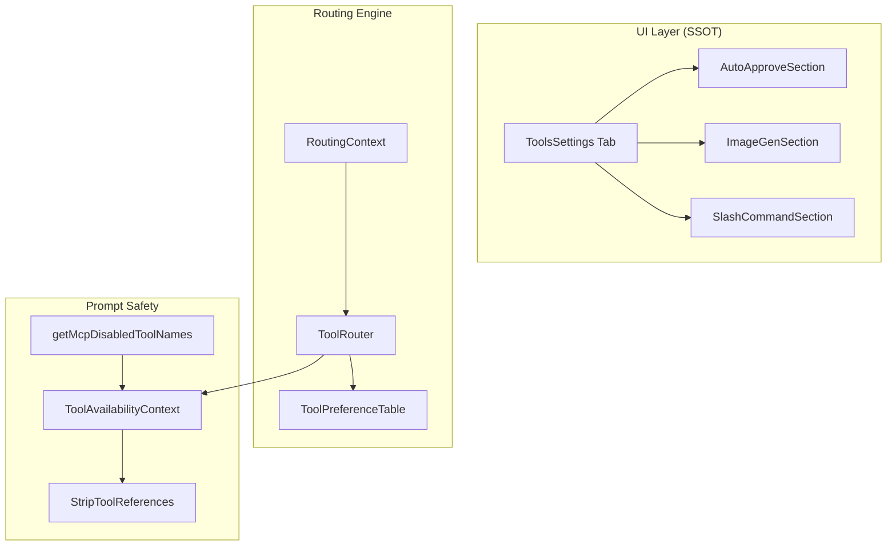

# Design Document: Unified Tool Orchestration

## Overview

The Unified Tool Orchestration system streamlines tool management through a consolidated UI and a deterministic routing layer. It ensures consistency between agent intent and tool selection while maintaining strict prompt safety for disabled capabilities.

## Architecture

### Component Diagram



### Integration Points

1.  **Tool Building Pipeline**: `buildNativeToolsArrayWithRestrictions` invokes `ToolRouter` and merges MCP disabled tools into `TAC`.
2.  **Settings Navigation**: `SettingsView.tsx` removed separate tabs for AutoApprove/SlashCommands.
3.  **Prompt Generation**: `system.ts` uses `TAC` and `StripToolReferences` to sanitize base instructions and custom instructions.

## Data Structures

### ToolRecommendation
```typescript
interface ToolRecommendation {
  primaryTool: string
  fallbackTools: string[]
  guidance: string
  intent: string
}
```

### RoutingContext
```typescript
interface RoutingContext {
  repoIndexed: boolean
  availableTools: string[]
  mode: string
  enforceJcodemunch: boolean
}
```

## Algorithms

### 1. Tool Routing
Maps `(intent, context) -> preference`. Filters by `availableTools`. Reorders array: indexed tools first if `repoIndexed` is true.

### 2. Prompt Sanitization
Iterates through `TAC.getDisabledToolNames()`. Uses dynamic regex to strip any line in instructions containing a backtick-wrapped disabled tool name.

## Performance Constraints
- **Routing**: < 1ms synchronous overhead.
- **UI Rendering**: Lazy loading of settings sections to maintain tab responsiveness.
- **Sanitization**: Linear scan of instruction text; O(N) where N is instruction length.
