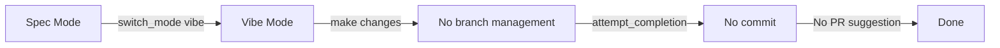
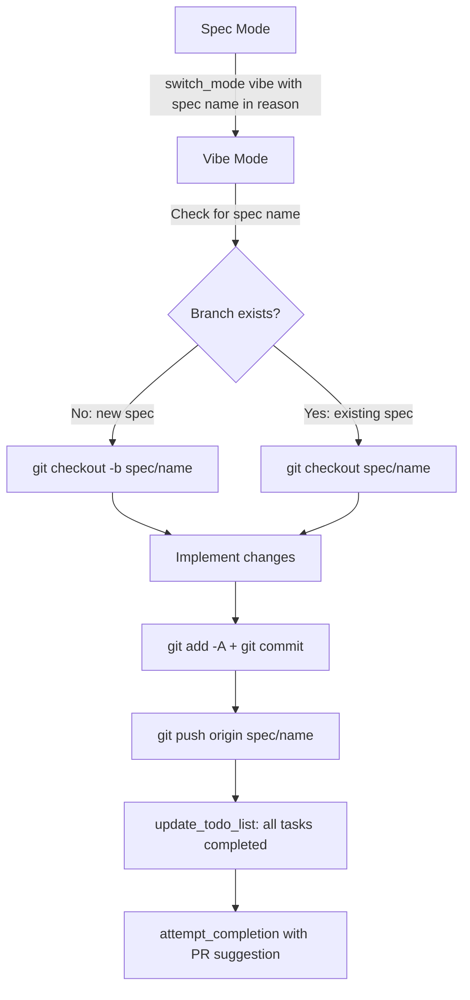

# Design Document: Vibe Git Workflow

## Overview

This feature adds structured git workflow behavior to the Vibe mode by modifying two mode definitions in [`packages/types/src/mode.ts`](packages/types/src/mode.ts:168):

1. **Vibe mode** — add `customInstructions` that enforce branch creation/reuse, committing, PR suggestion, and task completion
2. **Spec mode** — update `customInstructions` step 9 to include the spec name in the `switch_mode` reason parameter

No new tools, no tool implementation changes, no schema changes. Only the `customInstructions` strings on existing mode configs are modified.

## Architecture

### Current State



The Vibe mode currently has no `customInstructions`. It receives a bare `switch_mode` call from Spec with a generic reason like "Implementing the feature" — no spec name is passed.

### Proposed State



## Detailed Design

### Change 1: Vibe Mode `customInstructions`

Add a `customInstructions` field to the Vibe mode config at [`packages/types/src/mode.ts`](packages/types/src/mode.ts:182). The instructions will be a multi-line string covering the full git workflow.

**Key sections of the instructions:**

#### 1.1 Spec Name Detection

On entering Vibe mode, the agent must determine which spec it is working on. Three sources, in priority order:

1. **From `switch_mode` reason** — Spec mode will include the spec name in the reason (e.g., "Implementing spec: vibe-git-workflow"). The agent extracts the spec name from this string.
2. **From `.roo/specs/` directory** — If no spec name in the reason, list the directories under `.roo/specs/` and check which ones have a `tasks.md` file (indicating an approved spec ready for implementation).
3. **Ask the user** — If neither source yields a spec name, use `ask_followup_question` to ask which spec to implement.

#### 1.2 Branch Management

Once the spec name is known:

- Check if a branch named `spec/<spec-name>` exists: `git branch --list spec/<spec-name>`
- **If it does NOT exist** (new spec): `git checkout -b spec/<spec-name>`
- **If it DOES exist** (iterating on existing spec): `git checkout spec/<spec-name>`
- **Important**: Do NOT make any file changes until on the correct branch

#### 1.3 Commit Before Completion

Before calling `attempt_completion`:

1. `git add -A` — stage all changes
2. `git status --short` — verify there are staged changes
3. If there are staged changes: `git commit -m "type(scope): brief description"` using conventional commit format
4. If pre-commit hooks fail: fix issues, re-stage, retry commit
5. If no staged changes: skip commit (nothing to commit)

#### 1.4 Push and PR Suggestion

After committing:

1. `git push origin spec/<spec-name>` — push to the user's remote (origin), NOT upstream
2. If push fails due to no remote: inform user, ask for guidance
3. If push fails due to auth: inform user, do not retry indefinitely
4. Include PR suggestion in the `attempt_completion` result message, formatted as:
   - "Consider opening a PR from `origin:spec/<spec-name>` to `<default-branch>` on your repository."
   - Do NOT suggest pushing to upstream or opening a PR to the upstream repo

#### 1.5 Task Completion

Before calling `attempt_completion`:

1. Use `update_todo_list` to mark ALL tasks as `[x]` completed
2. Only mark a task as completed when its work is actually done
3. If a task cannot be completed, use `ask_followup_question` to inform the user rather than silently marking it

#### 1.6 Ordering Constraint

The completion sequence MUST be:

1. Commit changes (Requirement 3)
2. Push branch (Requirement 4)
3. Mark all tasks completed (Requirement 5)
4. Call `attempt_completion` with result including PR suggestion

This ordering ensures no uncommitted changes exist when the agent declares completion.

### Change 2: Spec Mode `customInstructions` Update

Modify step 9 of the Spec mode `customInstructions` at [`packages/types/src/mode.ts`](packages/types/src/mode.ts:179) to include the spec name in the `switch_mode` reason.

**Current** (truncated for brevity):
```
9. After all documents are complete, use the `ask_followup_question` tool to ask the user if they want to start implementation. If yes, use the `switch_mode` tool to switch to the appropriate mode based on the spec type chosen in step 4:
   - **bugfix** spec type → switch to **debug** mode (using the slug "debug")
   - **feature** spec type → switch to **vibe** mode (using the ...
```

**Proposed** — add to step 9:
```
   - The `reason` parameter for `switch_mode` MUST include the spec name in the format: "Implementing spec: <spec-name>" (e.g., "Implementing spec: vibe-git-workflow"). This allows the target mode to determine which spec to work on and whether to create a new branch or reuse an existing one.
```

### Change 3: No Other Changes

- No changes to `switch_mode` tool schema or implementation
- No changes to `attempt_completion` tool schema or implementation
- No changes to `update_todo_list` tool schema or implementation
- No changes to any handler code in `src/core/tools/`
- No changes to `src/shared/modes.ts`
- No changes to the `ModeConfig` type definition

## Edge Cases

### No Git Repository

If `git status` fails (not a git repo), the agent should skip all git operations and proceed directly to implementation. The `customInstructions` should include a fallback: "If this is not a git repository, skip branch management and commit steps."

### Direct Vibe Mode Entry (No Spec Handoff)

If the user enters Vibe mode directly (not via Spec mode switch), there may be no spec name. The instructions handle this via the 3-tier detection: reason → `.roo/specs/` directory → ask user. If the user is just making ad-hoc changes with no spec, the agent should still commit and push, but may work on whatever branch the user is currently on.

### Branch Already Checked Out

If the user is already on the `spec/<spec-name>` branch when Vibe starts, `git checkout spec/<spec-name>` is a no-op — safe to run anyway.

### Multiple Specs in `.roo/specs/`

If there are multiple spec directories, the agent should prefer the one mentioned in the `switch_mode` reason. If no reason is provided, it should ask the user which spec to implement.

### Push to Remote That Doesn't Have the Branch Yet

First push of a new branch requires `git push -u origin spec/<spec-name>` (with `-u` to set upstream tracking). Subsequent pushes can use just `git push origin spec/<spec-name>`.

## File Change Summary

| File | Change |
|------|--------|
| [`packages/types/src/mode.ts`](packages/types/src/mode.ts:182) | Add `customInstructions` to Vibe mode config |
| [`packages/types/src/mode.ts`](packages/types/src/mode.ts:179) | Update Spec mode step 9 to include spec name in switch_mode reason |

## Test Impact

- The `DEFAULT_MODES` constant is used extensively in tests. Adding `customInstructions` to the Vibe mode may affect snapshot tests in [`src/core/prompts/__tests__/`](src/core/prompts/__tests__/) that capture system prompts for different modes.
- Specifically, the snapshot at [`src/core/prompts/__tests__/__snapshots__/add-custom-instructions/vibe-mode-rules.snap`](src/core/prompts/__tests__/__snapshots__/add-custom-instructions/vibe-mode-rules.snap) will need updating.
- The Spec mode snapshot at [`src/core/prompts/__tests__/__snapshots__/add-custom-instructions/spec-mode-rules.snap`](src/core/prompts/__tests__/__snapshots__/add-custom-instructions/spec-mode-rules.snap) will also need updating.
- No new test files need to be created — existing snapshot tests will automatically detect the changes.