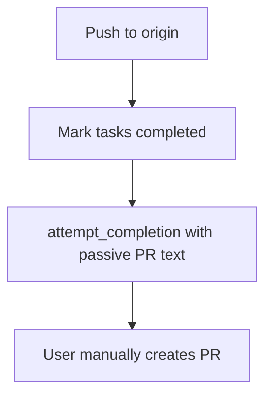
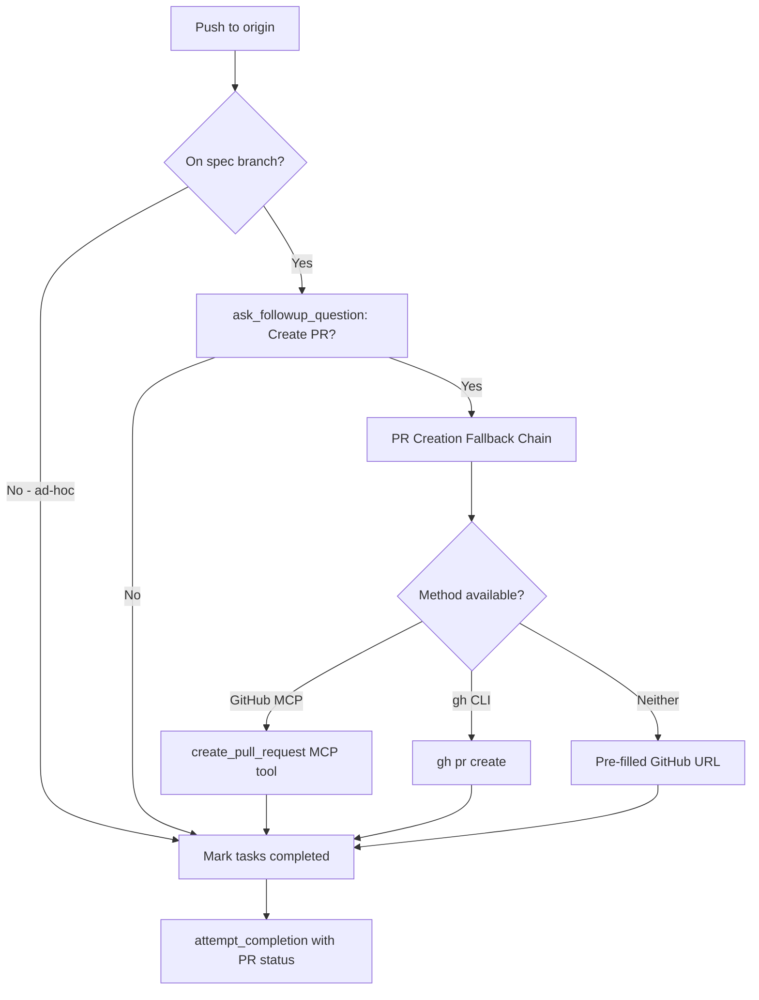

# Design Document: Vibe PR Creation

## Overview

This feature modifies the Vibe mode `customInstructions` in [`packages/types/src/mode.ts`](packages/types/src/mode.ts:190) to replace the passive PR suggestion with an interactive PR creation step. The agent will ask the user if they want a PR created, then use a three-tier fallback chain (GitHub MCP → `gh` CLI → URL) to create it.

No new files, no tool changes, no schema changes. Only the `customInstructions` string on the Vibe mode config is modified.

## Architecture

### Current State (after vibe-git-workflow spec)



The current flow pushes to `origin` and includes a text suggestion like "Consider opening a PR..." in the `attempt_completion` result. The user must manually navigate to GitHub and create the PR.

### Proposed State



## Detailed Design

### Change: Vibe Mode `customInstructions` — Replace Push/PR Section

The existing Vibe mode `customInstructions` has sections numbered 1–5 (Determine Spec Name, Branch Management, Mark Tasks, Commit, Push/PR Suggestion, Completion Ordering). This change:

1. **Renames** the "Push and PR Suggestion" section to "Push and PR Creation"
2. **Adds** a new interactive step between push and task completion: the `ask_followup_question` flow
3. **Replaces** the passive "Consider opening a PR..." text with the three-tier fallback chain
4. **Updates** the completion ordering to include the new step
5. **Updates** the `attempt_completion` guidance to include PR creation status

### New Section: Push and PR Creation (replaces old section 4/5)

The new section in the `customInstructions` string should read approximately:

```
### 4. Push and PR Creation

After committing changes:

1. Push the branch to **origin** (NOT upstream):
   - First push: `git push -u origin spec/<spec-name>`
   - Subsequent pushes: `git push origin spec/<spec-name>`

2. After a successful push, IF you are on a `spec/<spec-name>` branch
   (not the default branch, not an ad-hoc branch), ASK THE USER about
   creating a PR:

   Use `ask_followup_question` with:
   - Question: "I've pushed `spec/<spec-name>` to your repository. Would you like me to create a pull request from `spec/<spec-name>` to `<default-branch>` on your repo?"
   - Options:
     - "Yes, create the PR" → proceed to step 3
     - "No, I'll do it later" → skip to step 5

3. IF the user confirms, attempt to create the PR using this fallback chain:

   **Method 1 — GitHub MCP Tool (preferred):**
   - Check if a GitHub MCP tool for creating pull requests is available
     (e.g., a tool with a name containing "create_pull_request" from an
     MCP server). This is NOT a built-in tool — it only exists if the
     user has configured a GitHub MCP server.
   - IF available, use it with:
     - head: `spec/<spec-name>`
     - base: `<default-branch>` (determine dynamically, see below)
     - title: derived from the spec name (e.g., "feat: implement <spec-name>")
       or the latest commit message
     - body: "Implements the `<spec-name>` spec."
   - IF the MCP call succeeds → note the PR URL for the completion message
   - IF the MCP call fails or the tool is not available → fall through to Method 2

   **Method 2 — gh CLI (fallback):**
   - Run `gh --version` to check if the GitHub CLI is installed.
   - IF `gh` is available, run:
     `gh pr create --head spec/<spec-name> --base <default-branch> --title "<title>" --body "<body>"`
   - IF `gh pr create` succeeds → note the PR URL for the completion message
   - IF `gh` is not installed or the command fails → fall through to Method 3

   **Method 3 — Pre-filled URL (last resort):**
   - Determine the GitHub repository URL from the origin remote:
     `git remote get-url origin`
   - Construct a pre-filled "new PR" URL:
     `https://github.com/<owner>/<repo>/compare/<default-branch>...spec/<spec-name>?title=<title>&body=<body>`
   - Inform the user: "I couldn't create the PR automatically. You can open this URL to create it manually: <URL>"

4. Determine the default branch dynamically:
   - Run: `git symbolic-ref refs/remotes/origin/HEAD`
   - If that fails, try: `git remote show origin | grep 'HEAD branch'`
   - If both fail, default to `main`

5. Continue to the next step (mark tasks completed) regardless of whether
   a PR was created.
```

### Updated Completion Ordering

The completion sequence section should be updated from:

```
1. Commit changes
2. Push branch
3. Mark all tasks completed
4. Call attempt_completion
```

To:

```
1. Commit changes
2. Push branch to origin
3. Ask user about PR creation; create PR if confirmed (on spec branches only)
4. Mark all tasks completed
5. Call attempt_completion with PR status in the result message
```

### Updated `attempt_completion` Guidance

The `attempt_completion` result message should include:
- What was implemented
- Whether a PR was created (and a link if so), or that the user chose not to create one
- That all tasks have been marked complete

Example result text:
```
I've implemented the <spec-name> spec. Changes have been committed and
pushed to origin on the spec/<spec-name> branch.

PR: <PR URL if created | "Created a PR: <link>" | "User chose not to create a PR">

All tasks have been marked as completed.
```

### Edge Cases

| Edge Case | Behavior |
|-----------|----------|
| No git repo | Skip all git operations (existing behavior) |
| Ad-hoc changes (no spec) | Skip PR creation, go straight to task completion |
| On default branch (main/master) | Skip PR creation — no feature branch to PR from |
| Push fails | Inform user, do not attempt PR creation |
| `gh` not installed | Fall through to URL method |
| `gh` not authenticated | Fall through to URL method |
| GitHub MCP tool not available | Fall through to `gh` CLI method |
| GitHub MCP tool fails | Fall through to `gh` CLI method |
| Origin remote is not GitHub | URL method may not work; inform user with the compare URL anyway as a best effort |
| User says "No" to PR | Skip PR creation, proceed to task completion |

### Non-Tool-Agnostic Design

The `customInstructions` must NOT hard-code the assumption that any specific MCP tool exists. Key design decisions:

1. **Describe, don't reference**: Instead of `mcp--github--create_pull_request`, the instructions say "a tool with a name containing 'create_pull_request' from an MCP server — this only exists if the user has configured a GitHub MCP server."

2. **Runtime detection**: The agent checks for tool availability at runtime by examining available tools, not by relying on prompt-time knowledge.

3. **Graceful degradation**: Each method explicitly falls through to the next on failure. No method is treated as required.

4. **No MCP-specific error handling**: The instructions don't reference MCP-specific error codes or behaviors that would confuse the agent if MCP isn't configured.

## File Change Summary

| File | Change |
|------|--------|
| [`packages/types/src/mode.ts`](packages/types/src/mode.ts:190) | Replace the push/PR section of Vibe mode `customInstructions` with the new interactive PR creation flow |
| [`src/core/prompts/__tests__/__snapshots__/add-custom-instructions/vibe-mode-rules.snap`](src/core/prompts/__tests__/__snapshots__/add-custom-instructions/vibe-mode-rules.snap) | Update snapshot to match new customInstructions content |

## Test Impact

- The `DEFAULT_MODES` constant is used in snapshot tests. Changing the Vibe mode `customInstructions` will affect the snapshot at [`src/core/prompts/__tests__/__snapshots__/add-custom-instructions/vibe-mode-rules.snap`](src/core/prompts/__tests__/__snapshots__/add-custom-instructions/vibe-mode-rules.snap).
- No new test files need to be created — existing snapshot tests will automatically detect the changes.
- Run: `cd src && npx vitest run core/prompts/__tests__/add-custom-instructions.spec.ts`
